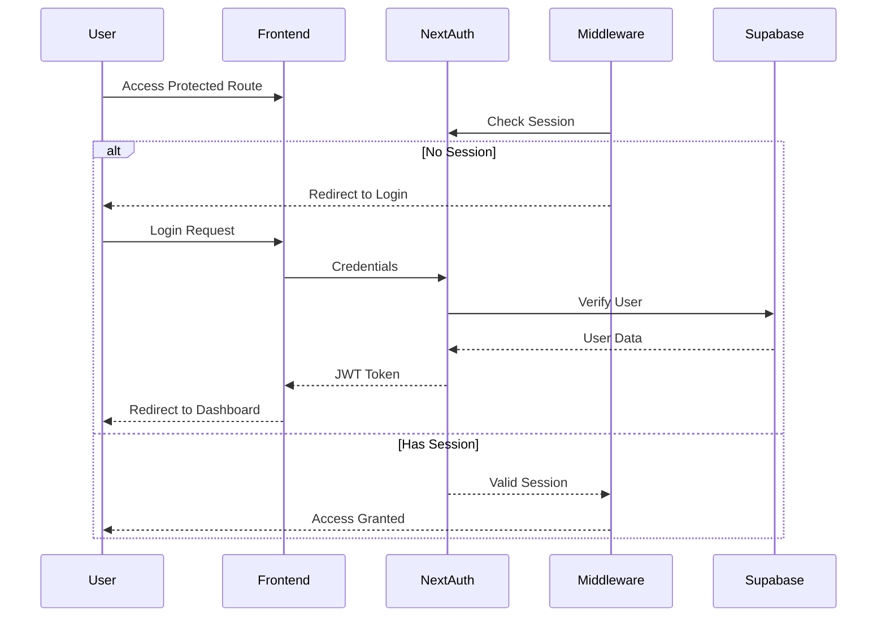

# Authentication System Documentation

## CRITICAL: Agent Compliance Requirements
Before modifying ANY authentication or RLS related code, agents MUST:
1. Confirm understanding of this document
2. Provide written confirmation of:
   - Current authentication flow
   - RLS policy implementation
   - Key usage (anon vs service)
3. Get explicit user approval for changes

## Overview
The Lovable CRM authentication system uses NextAuth.js with JWT strategy and Supabase for user management. The system implements secure password hashing, middleware-based route protection, and role-based access control.

## Key Principles
1. Client-Side Operations
   - MUST use NEXT_PUBLIC_SUPABASE_ANON_KEY
   - NEVER use service role key
   - Always respect RLS policies

2. Server-Side Operations
   - Use service role key only when necessary
   - Implement proper error handling
   - Validate all inputs

3. RLS Policies
   - MUST be tested in isolation
   - NEVER bypass RLS
   - Document all policy changes

## Components

### 1. Authentication Flow


### 2. Key Components

#### A. Middleware (`middleware.ts`)
- Protects all routes except public paths
- Redirects unauthenticated users to login
- Handles API routes protection
```typescript
export const config = {
    matcher: ['/((?!api/auth|_next/static|_next/image|favicon.ico|login).*)']
}
```

#### B. User Management
- Password hashing using bcrypt
- User creation/update API
- Admin reset endpoint for testing
```typescript
interface User {
    id: string;
    email: string;
    role: string;
    name: string;
    password_hash: string;
}
```

#### C. Environment Configuration
Required environment variables:
```env
NEXT_PUBLIC_SUPABASE_URL=your_supabase_url
NEXT_PUBLIC_SUPABASE_ANON_KEY=your_anon_key
SUPABASE_SERVICE_ROLE_KEY=your_service_key
NEXTAUTH_SECRET=your_secret
NEXTAUTH_URL=http://localhost:3001
```

### 3. Implementation Details

#### A. NextAuth Configuration (`auth-options.ts`)
```typescript
export const authOptions: NextAuthOptions = {
    providers: [CredentialsProvider],
    session: {
        strategy: "jwt",
        maxAge: 24 * 60 * 60, // 24 hours
    },
    pages: {
        signIn: "/login",
        error: "/login"
    }
}
```

#### B. User Authentication (`auth.ts`)
- Email-based user lookup
- Password verification using bcrypt
- Role-based session management

#### C. User Creation/Update (`create-user.ts`)
```typescript
export async function createOrUpdateUser(
    email: string,
    password: string,
    role: string = 'admin'
) {
    // Hash password
    const password_hash = await hashPassword(password);
    
    // Create or update user in Supabase
    // Returns success/error message
}
```

### 4. Security Features

#### A. Password Security
- Passwords are hashed using bcrypt
- Salt rounds: 10
- Never stored in plain text

#### B. Session Management
- JWT-based sessions
- 24-hour session lifetime
- HTTP-only cookies

#### C. Route Protection
- Middleware-based protection
- Role-based access control
- Protected API routes

### 5. Testing and Maintenance

#### A. Admin Reset Endpoint
- Available at `/api/auth/reset-admin`
- Creates/updates admin user
- Default credentials:
  - Email: admin@test.com
  - Password: test123456
  - Role: admin

#### B. Error Handling
- Detailed error logging
- User-friendly error messages
- Security-conscious error responses

## Supabase RLS and NextAuth Integration

#### Secure Public Access Pattern
When using NextAuth with Supabase, we can implement a simplified but secure RLS policy by leveraging NextAuth's server-side authentication as the primary security gate.

Example implementations:

1. Server-side authentication gate:
```typescript
// Calendar Page
export default async function CalendarPage() {
  const session = await getServerSession(authOptions)
  if (!session) {
    return redirect('/login')
  }
  return <CalendarClient session={session} />
}

// Tasks Page
export default async function TasksPage() {
  const session = await getServerSession(authOptions)
  if (!session) {
    return redirect('/login')
  }
  return <TasksClient session={session} />
}
```

2. Simplified RLS policies:
```sql
-- Calendar Events
CREATE POLICY "Allow authenticated access"
ON calendar_events
FOR ALL
TO PUBLIC
USING (true);

-- Tasks
CREATE POLICY "Allow authenticated access"
ON tasks
FOR ALL
TO PUBLIC
USING (true);
```

#### Security Considerations
This pattern is secure because:
1. Primary Security Gate: NextAuth's `getServerSession()` check happens at the server level
   - No one can reach the page without a valid session
   - Redirect to '/login' happens before any client code runs
   - Supabase client code only executes after authentication is confirmed

2. Supabase Endpoint Protection:
   - NEXT_PUBLIC_SUPABASE_ANON_KEY has limited permissions
   - API endpoint is protected by CORS settings (only accessible from your domain)
   - Direct API calls without a valid NextAuth session will fail

3. Multiple Security Layers:
   - NextAuth session validation (primary gate)
   - CORS protection (API level)
   - Service role key never leaves server

#### Benefits
- Simplified RLS policies
- Clear separation of concerns (NextAuth handles auth, Supabase handles data)
- Reduced complexity in token management
- Better performance (no need for token syncing)
- Maintainable and scalable approach

#### Implementation Notes
This pattern has been successfully implemented in both Calendar and Tasks components, solving authentication issues that were previously overcomplicating the solution with unnecessary token synchronization.

#### Client-Side Implementation
```typescript
// Calendar Client
export function CalendarClient({ session }: { session: Session }) {
  const handleCreateEvent = async (eventData: Partial<CalendarEvent>) => {
    try {
      await calendarService.createEvent({
        ...eventData,
      }, session)
    } catch (error) {
      console.error('Failed to create event:', error)
    }
  }
}

// Tasks Client
export function TasksClient({ session }: { session: Session }) {
  const handleCreateTask = async (taskData: Partial<Task>) => {
    try {
      const newTask = await taskService.createTask(taskData, session)
      setTasks([newTask, ...tasks])
    } catch (error) {
      console.error('Failed to create task:', error)
    }
  }
}
```

#### Service Layer Implementation
```typescript
// Calendar Service
export const calendarService = {
  async createEvent(event: CalendarEvent, session: Session) {
    if (!session) {
      throw new Error('User must be authenticated')
    }
    // Create event with user_id from session
    const { data, error } = await supabase
      .from('calendar_events')
      .insert({
        ...event,
        user_id: session.user.id
      })
  }
}

// Tasks Service
export const taskService = {
  async createTask(task: Task, session: Session) {
    if (!session) {
      throw new Error('User must be authenticated')
    }
    // Create task with user_id from session
    const { data, error } = await supabase
      .from('tasks')
      .insert({
        ...task,
        user_id: session.user.id
      })
  }
}
```

## Usage Examples

### 1. Protected Route Implementation
```typescript
// In page.tsx
import { getServerSession } from "next-auth/next";
import { redirect } from "next/navigation";

export default async function ProtectedPage() {
    const session = await getServerSession(authOptions);
    if (!session) redirect("/login");
    return <div>Protected Content</div>;
}
```

### 2. Role-Based Access
```typescript
// In admin pages
if (session?.user?.role !== 'admin') {
    redirect("/unauthorized");
}
```

### 3. API Route Protection
```typescript
// In API routes
import { getServerSession } from "next-auth/next";
import { NextResponse } from "next/server";

export async function GET() {
    const session = await getServerSession(authOptions);
    if (!session) {
        return NextResponse.json({ error: "Unauthorized" }, { status: 401 });
    }
    // Protected API logic
    return NextResponse.json({ data: "Protected data" });
}

## Required Agent Confirmations
Before making changes, agents must confirm understanding of:
1. Authentication Flow
   - [ ] NextAuth.js implementation
   - [ ] Middleware protection
   - [ ] Session management

2. RLS Policies
   - [ ] Current policy structure
   - [ ] Impact of changes
   - [ ] Testing approach

3. Key Usage
   - [ ] Anon key for client
   - [ ] Service role limitations
   - [ ] Security implications

## Required Confirmation Format
Agents must provide this confirmation:
```
I confirm understanding of:
1. Authentication Flow: [Describe current implementation]
2. RLS Policies: [Describe current policies]
3. Key Usage: [Describe where each key is used]
4. Proposed Changes: [Describe changes]
5. Rollback Plan: [Describe rollback approach]
```
