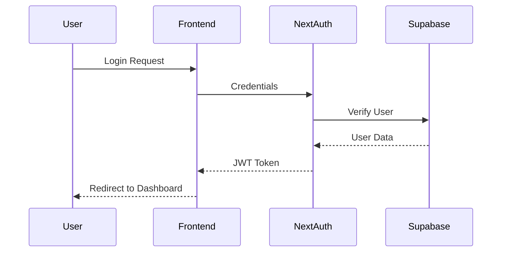

# Authentication System Documentation

## Overview
The Lovable CRM authentication system uses NextAuth.js with JWT strategy and Supabase for user management.

## Components

### 1. Authentication Flow


### 2. JWT Structure
```typescript
interface JWT {
    id: string;
    email: string;
    role: 'admin' | 'senior_management' | 'department_manager' | 'operational';
    name: string;
}
```

### 3. Session Management
```typescript
// Session configuration
session: {
    strategy: "jwt",
    maxAge: 24 * 60 * 60, // 24 hours
}
```

### 4. Protected Routes
- All routes under `(main)` require authentication
- Admin routes require admin role
- Department-specific routes check department access

## Implementation Details

### 1. NextAuth Configuration
```typescript
// auth-options.ts
export const authOptions: NextAuthOptions = {
    providers: [
        CredentialsProvider({
            // Credentials configuration
            async authorize(credentials) {
                // User verification logic
            }
        })
    ],
    callbacks: {
        async jwt({ token, user }) {
            // JWT token customization
        },
        async session({ session, token }) {
            // Session customization
        }
    }
}
```

### 2. Route Protection
```typescript
// Layout-based protection
export default async function ProtectedLayout({
    children,
}: {
    children: React.ReactNode
}) {
    const session = await getServerSession(authOptions)
    if (!session?.user) {
        redirect('/login')
    }
    return children
}
```

### 3. Role-Based Access
```typescript
// Role verification
export async function requireRole(allowedRoles: string[]) {
    const user = await requireAuth()
    if (!allowedRoles.includes(user.role)) {
        throw new Error('Not authorized')
    }
    return user
}
```

## Security Measures

### 1. Password Handling
- Passwords hashed using bcrypt
- Never stored in plain text
- Minimum password requirements enforced

### 2. Session Security
- JWT tokens stored in HTTP-only cookies
- CSRF protection enabled
- Session expiration after 24 hours

### 3. RLS Policies
- Row Level Security enforced at database level
- Role-based access control
- Department-level data isolation

## User Roles

### Admin
- Full system access
- User management capabilities
- System configuration access

### Senior Management
- Cross-department access
- Reporting capabilities
- User oversight

### Department Manager
- Department-specific access
- Team management
- Department reporting

### Operational
- Basic CRM functions
- Personal dashboard
- Assigned tasks only

## Error Handling

### Authentication Errors
- Invalid credentials
- Session expiration
- Unauthorized access attempts

### Response Format
```typescript
interface AuthError {
    message: string;
    code: string;
    status: number;
}
```

## Testing

### Test Cases
1. Login flow
2. Session management
3. Role-based access
4. Password security
5. Error handling

### Test Credentials
```
Admin User:
Email: admin@example.com
Password: password123
```
