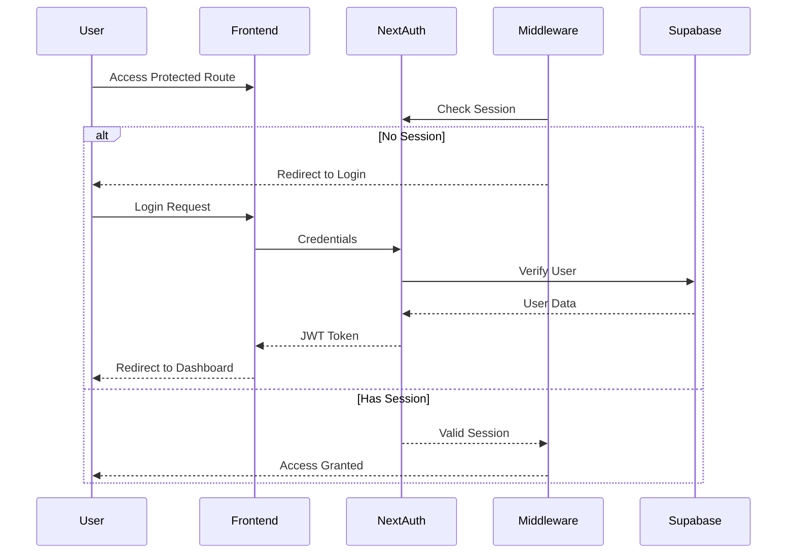

# Authentication System Documentation

## Overview
The Lovable CRM authentication system uses NextAuth.js with JWT strategy and Supabase for user management. The system implements secure password hashing, middleware-based route protection, and role-based access control.

## Components

### 1. Authentication Flow


### 2. Key Components

#### A. Middleware (`middleware.ts`)
- Protects all routes except public paths
- Redirects unauthenticated users to login
- Handles API routes protection
```typescript
export const config = {
    matcher: ['/((?!api/auth|_next/static|_next/image|favicon.ico|login).*)']
}
```

#### B. User Management
- Password hashing using bcrypt
- User creation/update API
- Admin reset endpoint for testing
```typescript
interface User {
    id: string;
    email: string;
    role: string;
    name: string;
    password_hash: string;
}
```

#### C. Environment Configuration
Required environment variables:
```env
NEXT_PUBLIC_SUPABASE_URL=your_supabase_url
NEXT_PUBLIC_SUPABASE_ANON_KEY=your_anon_key
SUPABASE_SERVICE_ROLE_KEY=your_service_key
NEXTAUTH_SECRET=your_secret
NEXTAUTH_URL=http://localhost:3001
```

### 3. Implementation Details

#### A. NextAuth Configuration (`auth-options.ts`)
```typescript
export const authOptions: NextAuthOptions = {
    providers: [CredentialsProvider],
    session: {
        strategy: "jwt",
        maxAge: 24 * 60 * 60, // 24 hours
    },
    pages: {
        signIn: "/login",
        error: "/login"
    }
}
```

#### B. User Authentication (`auth.ts`)
- Email-based user lookup
- Password verification using bcrypt
- Role-based session management

#### C. User Creation/Update (`create-user.ts`)
```typescript
export async function createOrUpdateUser(
    email: string,
    password: string,
    role: string = 'admin'
) {
    // Hash password
    const password_hash = await hashPassword(password);
    
    // Create or update user in Supabase
    // Returns success/error message
}
```

### 4. Security Features

#### A. Password Security
- Passwords are hashed using bcrypt
- Salt rounds: 10
- Never stored in plain text

#### B. Session Management
- JWT-based sessions
- 24-hour session lifetime
- HTTP-only cookies

#### C. Route Protection
- Middleware-based protection
- Role-based access control
- Protected API routes

### 5. Testing and Maintenance

#### A. Admin Reset Endpoint
- Available at `/api/auth/reset-admin`
- Creates/updates admin user
- Default credentials:
  - Email: admin@test.com
  - Password: test123456
  - Role: admin

#### B. Error Handling
- Detailed error logging
- User-friendly error messages
- Security-conscious error responses

## Usage Examples

### 1. Protected Route Implementation
```typescript
// In page.tsx
import { getServerSession } from "next-auth/next";
import { redirect } from "next/navigation";

export default async function ProtectedPage() {
    const session = await getServerSession(authOptions);
    if (!session) redirect("/login");
    return <div>Protected Content</div>;
}
```

### 2. Role-Based Access
```typescript
// In admin pages
if (session?.user?.role !== 'admin') {
    redirect("/unauthorized");
}
```

### 3. API Route Protection
```typescript
// In API routes
import { getServerSession } from "next-auth/next";
import { NextResponse } from "next/server";

export async function GET() {
    const session = await getServerSession(authOptions);
    if (!session) {
        return NextResponse.json({ error: "Unauthorized" }, { status: 401 });
    }
    // Protected API logic
}
