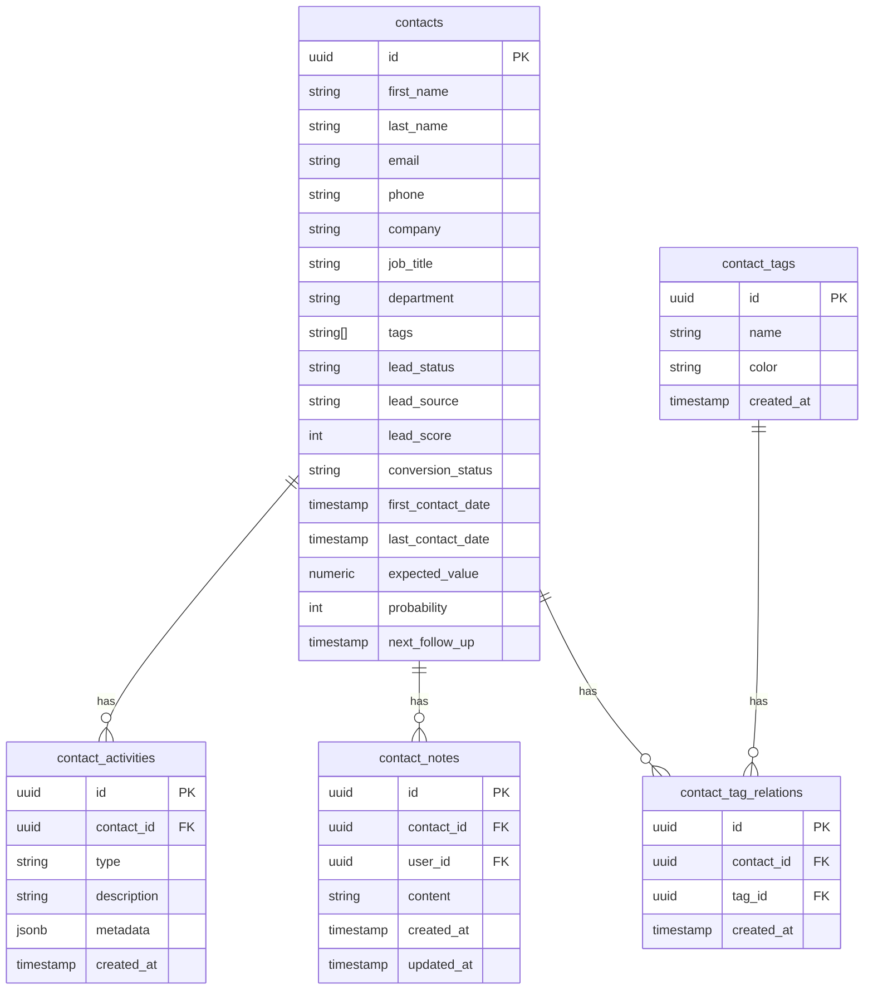
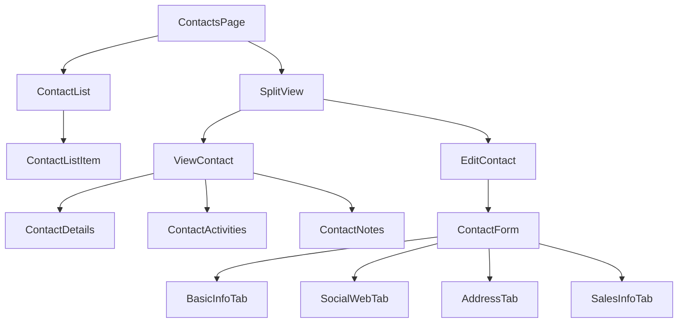

# Contacts Implementation Guide

## Database Structure



## Component Structure



## Form Fields Organization

### Basic Information Tab
- Personal Details
  - First Name*
  - Last Name*
  - Email
  - Phone
- Company Details
  - Company Name
  - Job Title
  - Department

### Social & Web Tab
- Online Presence
  - Website URL
  - LinkedIn Profile
  - Twitter Handle

### Address Tab
- Location Details
  - Address Line 1
  - Address Line 2
  - City
  - Region/State
  - Postal Code
  - Country

### Sales Information Tab
- Lead Information
  - Lead Status (new, contacted, qualified, unqualified)
  - Lead Source (website, referral, social_media, email, other)
  - Lead Score (0-100)
  - Conversion Status (lead, opportunity, customer, lost)
- Deal Details
  - Expected Value ($)
  - Probability (%)
- Timeline
  - First Contact Date
  - Last Contact Date
  - Next Follow-up Date

## Related Tables Structure

### contacts
Primary table storing contact information
- Basic personal and professional details
- Sales-related fields
- Tracking fields (created_at, updated_at)

### contact_activities
Tracks all interactions with contacts
- Type (call, email, meeting, etc.)
- Description
- Metadata (JSON for flexible additional data)
- Timestamps

### contact_notes
Stores notes and comments about contacts
- Content
- User attribution
- Timestamps

### contact_tags
Manages tags for categorizing contacts
- Name
- Color (for UI display)
- Creation timestamp

### contact_tag_relations
Junction table for contact-tag relationships
- Links contacts to their tags
- Allows for many-to-many relationships

## UI Components

### ViewContact Component
```
┌─────────────────────────────────┐
│ Contact Header                  │
├─────────────────────────────────┤
│ ┌─────┐                        │
│ │     │ Name                   │
│ │ AV  │ Company & Title        │
│ │     │ Quick Action Buttons   │
│ └─────┘                        │
├─────────────────────────────────┤
│ Contact Information Cards       │
│ ┌────────┐ ┌────────┐         │
│ │Phone   │ │Email   │         │
│ └────────┘ └────────┘         │
│ ┌────────┐ ┌────────┐         │
│ │Company │ │Dept    │         │
│ └────────┘ └────────┘         │
├─────────────────────────────────┤
│ Activities & Notes              │
└─────────────────────────────────┘
```

### ContactForm Component
```
┌─────────────────────────────────┐
│ [Basic] [Social] [Address] [Sales] │
├─────────────────────────────────┤
│ Form Fields                     │
│ ┌────────┐ ┌────────┐         │
│ │Field 1 │ │Field 2 │         │
│ └────────┘ └────────┘         │
│                               │
│ ┌────────┐ ┌────────┐         │
│ │Field 3 │ │Field 4 │         │
│ └────────┘ └────────┘         │
├─────────────────────────────────┤
│ [Cancel]            [Save]      │
└─────────────────────────────────┘
```

## State Management

The contacts system uses a combination of:
1. Local state for form handling
2. Global state for contact list and filters
3. SplitView state for managing the split view layout
4. Database state for persistence

## Key Features

1. Contact Management
   - Create, Read, Update, Delete operations
   - Rich contact profiles
   - Tag-based organization

2. Activity Tracking
   - Automated activity logging
   - Manual activity entries
   - Activity timeline

3. Notes System
   - Rich text notes
   - User attribution
   - Timestamp tracking

4. Sales Pipeline Integration
   - Lead status tracking
   - Deal value management
   - Follow-up scheduling 

## Expandable Sections UI Pattern

### Contact Card Layout
```
┌────────────────────────────────────┐
│ Contact Header with Avatar         │
├────────────────────────────────────┤
│ Permanent Information              │
│ ┌──────────┐  ┌──────────┐        │
│ │ Phone    │  │ Email    │        │
│ └──────────┘  └──────────┘        │
│ ┌──────────┐  ┌──────────┐        │
│ │ Company  │  │ Title    │        │
│ └──────────┘  └──────────┘        │
├────────────────────────────────────┤
│ ▼ Scheduling & Activities         │
├────────────────────────────────────┤
│ ▼ Tags & Categories              │
├────────────────────────────────────┤
│ ▼ Sales Pipeline                 │
├────────────────────────────────────┤
│ ▼ Notes & Attachments            │
└────────────────────────────────────┘
```

### Expandable Section Animation
```
Before Click:
┌────────────────────────────────┐
│ ▼ Scheduling & Activities     │
└────────────────────────────────┘

After Click:
┌────────────────────────────────┐
│ ▲ Scheduling & Activities     │
├────────────────────────────────┤
│ ┌──────────┐ ┌──────────┐     │
│ │ 📞 Call  │ │ 📧 Email │     │
│ └──────────┘ └──────────┘     │
│                               │
│ Assign To: [User Dropdown ▼]  │
│ Date: [Calendar Picker 📅]    │
│ Time: [Time Picker ⏰]        │
└────────────────────────────────┘
```

### Section Types and Features

1. **Permanent Information (Always Visible)**
   - Contact basics (name, phone, email)
   - Company information
   - Quick action buttons
   - Status indicators

2. **Scheduling & Activities (Expandable)**
   - Meeting scheduler
   - Call planner
   - Email composer
   - Activity timeline
   - User assignment
   - Calendar integration

3. **Tags & Categories (Expandable)**
   - Tag management
   - Category assignment
   - Custom fields
   - Organization grouping

4. **Sales Pipeline (Expandable)**
   - Lead status
   - Deal value
   - Probability
   - Pipeline stage
   - Follow-up dates

5. **Notes & Attachments (Expandable)**
   - Note editor
   - File attachments
   - Link sharing
   - Activity logs

### Animation Specifications
```typescript
// Framer Motion animation config
const expandConfig = {
  initial: { height: 0, opacity: 0 },
  animate: { 
    height: "auto", 
    opacity: 1,
    transition: {
      height: {
        type: "spring",
        stiffness: 50,
        damping: 15
      },
      opacity: {
        duration: 0.2
      }
    }
  },
  exit: { 
    height: 0, 
    opacity: 0,
    transition: {
      height: {
        type: "spring",
        stiffness: 50,
        damping: 15
      },
      opacity: {
        duration: 0.2
      }
    }
  }
}
```

### Implementation Benefits
1. **Better Organization**
   - Information is logically grouped
   - Less overwhelming for users
   - Focused interaction with specific features

2. **Performance**
   - Only load/render expanded sections
   - Reduced initial load time
   - Better memory management

3. **User Experience**
   - Clear visual hierarchy
   - Smooth animations
   - Intuitive interaction model

4. **Maintainability**
   - Modular section components
   - Easier to add new sections
   - Isolated feature development

### Example Section Component
```typescript
interface ExpandableSectionProps {
  title: string
  icon: LucideIcon
  children: React.ReactNode
}

function ExpandableSection({ title, icon: Icon, children }: ExpandableSectionProps) {
  const [isExpanded, setIsExpanded] = useState(false)

  return (
    <div className="border-b border-white/[0.08]">
      <button
        onClick={() => setIsExpanded(!isExpanded)}
        className="w-full px-6 py-4 flex items-center justify-between hover:bg-white/[0.02]"
      >
        <div className="flex items-center gap-3">
          <Icon className="w-5 h-5 text-blue-500" />
          <span className="font-medium text-white">{title}</span>
        </div>
        <ChevronDown 
          className={cn(
            "w-4 h-4 text-zinc-400 transition-transform",
            isExpanded && "rotate-180"
          )} 
        />
      </button>

      <AnimatePresence>
        {isExpanded && (
          <motion.div
            initial="initial"
            animate="animate"
            exit="exit"
            variants={expandConfig}
          >
            <div className="px-6 py-4 bg-black/40">
              {children}
            </div>
          </motion.div>
        )}
      </AnimatePresence>
    </div>
  )
} 