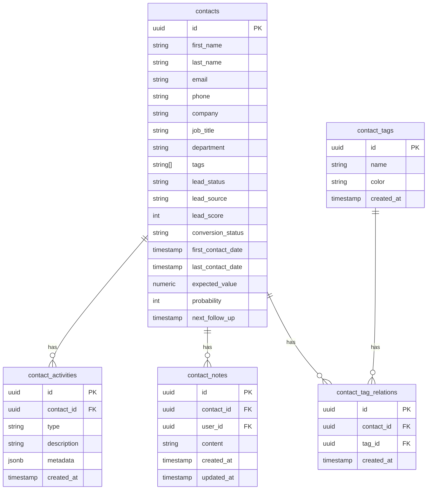
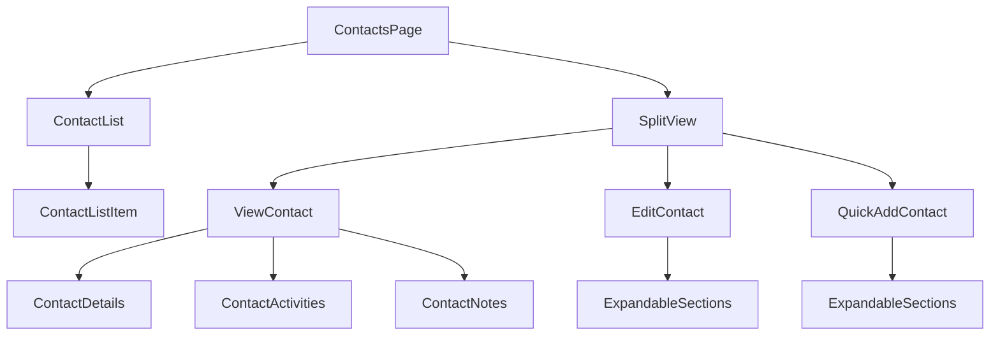

# Contacts Implementation Guide

## Database Structure



## Component Structure



## Form Organization

### Quick Add Contact Form
```
┌─────────────────────────────────┐
│ Create Contact                  │
├─────────────────────────────────┤
│ ▼ Personal Information         │
│   First Name*                   │
│   Last Name                     │
│   Email                         │
│   Phone                         │
├─────────────────────────────────┤
│ ▼ Work Information            │
│   Company                       │
│   Job Title                     │
│   Department                    │
├─────────────────────────────────┤
│ ▼ Social & Web Links          │
│   Website                       │
│   LinkedIn                      │
│   Twitter                       │
├─────────────────────────────────┤
│ ▼ Address Information         │
│   Address Line 1               │
│   Address Line 2               │
│   City                         │
│   Region                       │
│   Postal Code                  │
│   Country                      │
├─────────────────────────────────┤
│ ▼ Lead Information           │
│   Lead Status                  │
│   Lead Source                  │
│   Lead Score                   │
│   Expected Value               │
│   Probability                  │
├─────────────────────────────────┤
│ ▼ Tags                       │
│   Tag Selection                │
└─────────────────────────────────┘
```

### View Contact Layout
```
┌─────────────────────────────────┐
│ Contact Header with Avatar      │
│ ┌─────┐                        │
│ │     │ Name                   │
│ │ AV  │ Company & Title        │
│ │     │ Quick Action Buttons   │
│ └─────┘                        │
├─────────────────────────────────┤
│ Contact Information            │
│ ┌────────┐ ┌────────┐         │
│ │Phone   │ │Email   │         │
│ └────────┘ └────────┘         │
├─────────────────────────────────┤
│ ▼ Lead Information           │
│   Status, Source, Score        │
├─────────────────────────────────┤
│ ▼ Activities & Notes         │
│   Timeline of interactions     │
└─────────────────────────────────┘
```

## Styling Standards

### Colors and Backgrounds
- Form sections: `bg-black`
- Input fields: `bg-white/[0.03]`
- Borders: `border-white/[0.08]`
- Text: 
  - Primary: `text-white`
  - Secondary: `text-white/70`
  - Muted: `text-white/50`

### Avatar Colors
```typescript
const gradients = [
  'from-pink-500 to-rose-500',
  'from-blue-500 to-indigo-500',
  'from-green-500 to-emerald-500',
  'from-purple-500 to-violet-500',
  'from-orange-500 to-amber-500',
  'from-cyan-500 to-sky-500'
];
```

### Animations
- Split view: Spring animation (stiffness: 50, damping: 15)
- Expandable sections: 0.2s ease-in-out
- Page transitions: 1.2s with custom easing

## Implementation Details

### Contact Creation Flow
1. User opens Quick Add Contact form
2. Form displays in split view with expandable sections
3. Required fields are marked with asterisk
4. Tags can be selected or created inline
5. Form submission creates:
   - Contact record
   - Tag relations
   - Initial activity log

### Contact View Flow
1. User clicks contact in list
2. View displays in split view
3. Information is organized in expandable sections
4. Quick actions available in header
5. Activities and notes in chronological order

### Contact Edit Flow
1. User clicks edit button
2. Form displays in split view
3. All sections are expandable
4. Changes are saved immediately
5. Tags are managed inline

## Key Features

1. Contact Management
   - Create, Read, Update, Delete operations
   - Rich contact profiles
   - Tag-based organization

2. Activity Tracking
   - Automated activity logging
   - Manual activity entries
   - Activity timeline

3. Notes System
   - Rich text notes
   - User attribution
   - Timestamp tracking

4. Sales Pipeline Integration
   - Lead status tracking
   - Deal value management
   - Follow-up scheduling