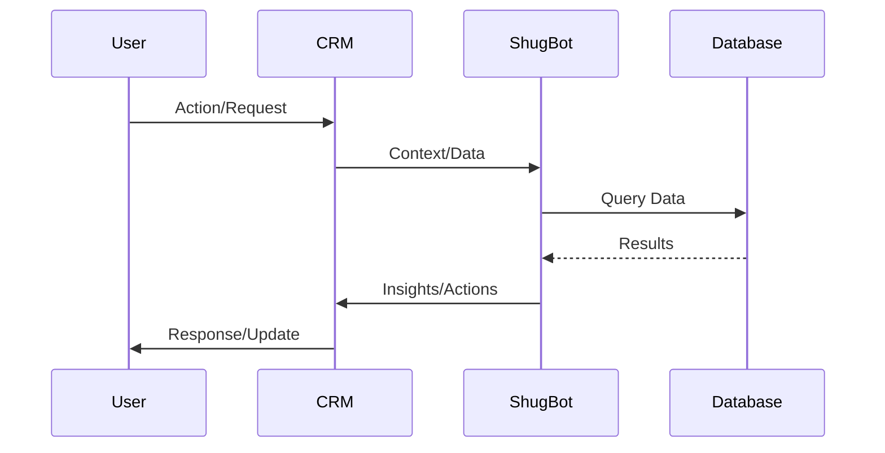

# ShugBot Integration Documentation

## Overview
ShugBot is an AI-powered assistant integrated into the Lovable CRM to provide intelligent insights, automation, and enhanced user experience.

## Integration Architecture

### 1. Component Structure
```typescript
interface ShugBotSystem {
    core: {
        nlp: 'natural language processing';
        ml: 'machine learning predictions';
        automation: 'task automation';
    };
    integration: {
        crm: 'data access';
        communication: 'user interaction';
        tasks: 'task management';
    };
}
```

### 2. Communication Flow


## Features

### 1. Intelligent Insights
```typescript
interface InsightEngine {
    contactAnalysis: {
        relationshipScoring: boolean;
        interactionHistory: boolean;
        nextBestAction: boolean;
    };
    businessIntelligence: {
        trendAnalysis: boolean;
        performanceMetrics: boolean;
        predictiveAnalytics: boolean;
    };
}
```

### 2. Task Automation
```typescript
interface AutomationSystem {
    taskManagement: {
        prioritization: boolean;
        assignment: boolean;
        scheduling: boolean;
    };
    workflow: {
        templateCreation: boolean;
        triggerActions: boolean;
        notifications: boolean;
    };
}
```

### 3. Natural Language Processing
```typescript
interface NLPFeatures {
    understanding: {
        intentRecognition: boolean;
        entityExtraction: boolean;
        contextAwareness: boolean;
    };
    generation: {
        responses: boolean;
        summaries: boolean;
        recommendations: boolean;
    };
}
```

## API Endpoints

### 1. Insights API
```typescript
// Get contact insights
GET /api/shugbot/insights/contact/:id
Response: {
    relationshipScore: number;
    nextActions: Action[];
    recommendations: string[];
}

// Get business insights
GET /api/shugbot/insights/business
Response: {
    trends: Trend[];
    predictions: Prediction[];
    alerts: Alert[];
}
```

### 2. Automation API
```typescript
// Create automated task
POST /api/shugbot/tasks/create
Body: {
    type: TaskType;
    context: TaskContext;
    priority: Priority;
}

// Get task recommendations
GET /api/shugbot/tasks/recommendations
Response: {
    tasks: Task[];
    priority: Priority[];
    assignments: Assignment[];
}
```

### 3. NLP API
```typescript
// Process natural language query
POST /api/shugbot/nlp/process
Body: {
    query: string;
    context: Context;
}
Response: {
    intent: Intent;
    entities: Entity[];
    response: string;
}
```

## Implementation

### 1. Setup
```typescript
// Initialize ShugBot
const shugbot = new ShugBot({
    apiKey: process.env.SHUGBOT_API_KEY,
    model: 'advanced',
    features: ['insights', 'automation', 'nlp']
});

// Configure integration
shugbot.configure({
    database: supabase,
    auth: nextAuth,
    notifications: true
});
```

### 2. Usage
```typescript
// Example: Get contact insights
async function getContactInsights(contactId: string) {
    const insights = await shugbot.analyze({
        type: 'contact',
        id: contactId,
        include: ['score', 'actions', 'predictions']
    });
    return insights;
}

// Example: Automate task creation
async function createAutomatedTask(context: TaskContext) {
    const task = await shugbot.createTask({
        context,
        priority: 'auto',
        assignTo: 'best-match'
    });
    return task;
}
```

## Security

### 1. Authentication
```typescript
interface SecurityConfig {
    authentication: {
        apiKey: string;
        jwt: boolean;
        encryption: 'AES-256';
    };
    authorization: {
        roleBasedAccess: boolean;
        scopedPermissions: boolean;
    };
}
```

### 2. Data Protection
```typescript
interface DataProtection {
    encryption: {
        inTransit: boolean;
        atRest: boolean;
    };
    privacy: {
        dataMinimization: boolean;
        userConsent: boolean;
    };
}
```

## Error Handling

### 1. Error Types
```typescript
interface ShugBotError {
    code: string;
    message: string;
    context?: any;
    timestamp: Date;
}

type ErrorType =
    | 'API_ERROR'
    | 'AUTHENTICATION_ERROR'
    | 'PROCESSING_ERROR'
    | 'RATE_LIMIT_ERROR';
```

### 2. Error Responses
```typescript
// Example error handling
try {
    const result = await shugbot.process(request);
    return result;
} catch (error: ShugBotError) {
    logger.error({
        code: error.code,
        message: error.message,
        context: error.context
    });
    return handleError(error);
}
```

## Testing

### 1. Integration Tests
```typescript
describe('ShugBot Integration', () => {
    test('Processes natural language queries')
    test('Generates accurate insights')
    test('Automates tasks correctly')
    test('Handles errors appropriately')
});
```

### 2. Performance Tests
```typescript
describe('Performance', () => {
    test('Response time within limits')
    test('Handles concurrent requests')
    test('Manages resource usage')
});
```

## Monitoring

### 1. Metrics
```typescript
interface Metrics {
    performance: {
        responseTime: number;
        throughput: number;
        errorRate: number;
    };
    usage: {
        apiCalls: number;
        resourceUsage: Usage;
        costs: number;
    };
}
```

### 2. Logging
```typescript
interface LogConfig {
    levels: ['error', 'warn', 'info', 'debug'];
    storage: {
        retention: '30d';
        encryption: boolean;
    };
}
```

## Future Enhancements

### 1. Planned Features
- Advanced prediction models
- Real-time insights
- Custom automation rules
- Enhanced NLP capabilities

### 2. Integration Expansion
- Email integration
- Calendar management
- Document analysis
- Voice interface
