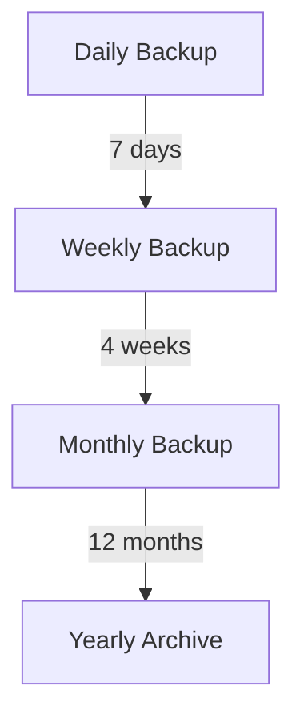

# Backup and Maintenance Procedures

## Database Backup

### 1. Supabase Backup Configuration
```typescript
interface BackupConfig {
    automated: {
        daily: boolean;
        weekly: boolean;
        monthly: boolean;
    };
    retention: {
        daily: '7 days';
        weekly: '4 weeks';
        monthly: '12 months';
    };
    encryption: {
        enabled: boolean;
        algorithm: 'AES-256';
    };
}
```

### 2. Backup Schedule


## Maintenance Tasks

### 1. Regular Checks
- Database performance
- Storage usage
- Error logs
- Security audits

### 2. System Updates
```typescript
interface MaintenanceSchedule {
    security: {
        frequency: 'weekly';
        priority: 'high';
    };
    performance: {
        frequency: 'monthly';
        priority: 'medium';
    };
    features: {
        frequency: 'quarterly';
        priority: 'normal';
    };
}
```

## Recovery Procedures

### 1. Database Recovery
```typescript
async function recoverDatabase(
    timestamp: Date,
    config: RecoveryConfig
) {
    // 1. Stop application
    // 2. Restore backup
    // 3. Verify data
    // 4. Restart application
}
```

### 2. Application Recovery
```typescript
interface RecoveryPlan {
    steps: {
        assessment: boolean;
        backup: boolean;
        restore: boolean;
        verify: boolean;
    };
    notification: {
        team: boolean;
        users: boolean;
    };
}
```

## Monitoring

### 1. Performance Metrics
```typescript
interface Metrics {
    database: {
        connections: number;
        queryTime: number;
        storage: number;
    };
    application: {
        responseTime: number;
        errorRate: number;
        uptime: number;
    };
}
```

### 2. Alert System
```typescript
interface AlertConfig {
    triggers: {
        highLoad: boolean;
        errors: boolean;
        storage: boolean;
    };
    notifications: {
        email: boolean;
        slack: boolean;
        sms: boolean;
    };
}
```

## Security Maintenance

### 1. Access Review
```typescript
interface SecurityAudit {
    frequency: 'monthly';
    checks: {
        userAccess: boolean;
        rolePermissions: boolean;
        apiKeys: boolean;
    };
}
```

### 2. Security Updates
```typescript
interface SecurityMaintenance {
    patches: {
        critical: 'immediate';
        high: '24h';
        medium: '1 week';
    };
    reviews: {
        code: 'monthly';
        configuration: 'weekly';
        dependencies: 'daily';
    };
}
```

## Disaster Recovery

### 1. Backup Verification
```typescript
interface BackupVerification {
    checks: {
        integrity: boolean;
        completeness: boolean;
        accessibility: boolean;
    };
    frequency: 'weekly';
}
```

### 2. Recovery Testing
```typescript
interface RecoveryTesting {
    scenarios: {
        databaseFailure: boolean;
        applicationCrash: boolean;
        securityBreach: boolean;
    };
    frequency: 'quarterly';
}
```

## Documentation

### 1. Maintenance Logs
```typescript
interface MaintenanceLogs {
    entries: {
        timestamp: Date;
        type: MaintenanceType;
        description: string;
        outcome: string;
    }[];
    retention: '12 months';
}
```

### 2. Incident Reports
```typescript
interface IncidentReport {
    details: {
        timestamp: Date;
        severity: Severity;
        impact: string;
        resolution: string;
    };
    followup: {
        actions: string[];
        prevention: string[];
    };
}
```

## Best Practices

### 1. Backup Guidelines
- Regular testing of backups
- Secure storage of backup data
- Multiple backup locations
- Automated verification

### 2. Maintenance Guidelines
- Scheduled maintenance windows
- Change management process
- Testing procedures
- Documentation updates

## Emergency Procedures

### 1. Contact List
```typescript
interface EmergencyContacts {
    technical: {
        primary: Contact;
        backup: Contact;
    };
    management: {
        primary: Contact;
        backup: Contact;
    };
}
```

### 2. Response Plan
```typescript
interface EmergencyResponse {
    steps: {
        assessment: string;
        containment: string;
        recovery: string;
        review: string;
    };
    communication: {
        internal: string[];
        external: string[];
    };
}
```

## Compliance

### 1. Audit Requirements
```typescript
interface ComplianceAudit {
    requirements: {
        dataProtection: boolean;
        security: boolean;
        backup: boolean;
    };
    frequency: 'annual';
}
```

### 2. Documentation Requirements
```typescript
interface ComplianceDocuments {
    types: {
        procedures: boolean;
        logs: boolean;
        reports: boolean;
    };
    retention: '7 years';
}
```
