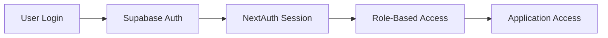

# Admin User Management Implementation Tracker

## Important Context for New Agents
Before starting any implementation work, understand these key points:
1. This is a CLOSED SYSTEM - no public access
2. Only admins can create users
3. DO NOT attempt to convert to API-only architecture
4. DO NOT modify existing auth flow

## Authentication Flow


1. **Initial Authentication**
   - Supabase handles credentials
   - Password hashing via bcrypt
   - Returns auth token

2. **Session Management**
   - NextAuth manages user session
   - JWT strategy with 30-day maxAge
   - Includes: id, email, name, role

3. **Access Control**
   - Role-based access via NextAuth session
   - Admin rights checked through session
   - No public routes/access

## Authentication Flow Implementation

### Key Components
1. **NextAuth Credentials Provider**
   - Direct integration with Supabase Auth
   - Single authentication check
   - No redundant database queries

2. **Login Process**
```typescript
// Core authentication flow
const result = await signIn('credentials', {
  email,
  password,
  redirect: false
})

// Simple error handling
if (result?.error) {
  setError(result.error)
  console.error('Login error:', result.error)
} else {
  router.push('/dashboard')
}
```

3. **Important Notes**
   - Use single Supabase Auth check
   - Avoid duplicate database queries
   - Maintain error logging for debugging
   - Keep error messages user-friendly

4. **Security Considerations**
   - Password verification via Supabase Auth
   - Session management via NextAuth
   - Role-based access control
   - Department-specific permissions

## System Architecture Overview
- NextAuth.js for session/role management
- Supabase for authentication and data storage
- Closed system (no public registration)
- Admin-only user creation

### Database Structure
```sql
-- Users Table
CREATE TABLE public.users (
  id UUID PRIMARY KEY DEFAULT uuid_generate_v4(),
  email TEXT UNIQUE NOT NULL,
  password_hash TEXT NOT NULL,
  name TEXT NOT NULL,
  role TEXT NOT NULL CHECK (role IN ('admin', 'manager', 'operational')),
  department TEXT NOT NULL CHECK (department IN ('management', 'sales', 'accounts', 'trade_shop')),
  is_active BOOLEAN DEFAULT true,
  created_at TIMESTAMPTZ DEFAULT NOW(),
  updated_at TIMESTAMPTZ DEFAULT NOW()
);
```

### Role Definitions
- **admin**: Full system access, user management
- **manager**: Department-level access and management
- **operational**: Basic system access

### Department Structure
- management
- sales
- accounts
- trade_shop

## Current State Assessment
- [x] Basic admin page structure exists
- [x] Supabase + NextAuth integration working
- [x] Basic user creation form
- [x] Role-based access control via NextAuth
- [ ] Complete error handling
- [ ] Department management
- [ ] User editing functionality

## Implementation Checklist

### Phase 1: Admin Interface Enhancement
- [ ] User Creation Improvements
  - [ ] Better form validation
  - [ ] Clear success/error messaging
  - [ ] Department selection validation
  - [ ] Role selection validation
  - [ ] Temporary password handling
  
  **Implementation Notes:**
  - Use client-side validation with Zod
  - Maintain existing Supabase auth flow
  - Add toast notifications for feedback

### Phase 2: User Management Features
- [ ] User Listing Improvements
  - [ ] Better data presentation
  - [ ] Sorting capabilities
  - [ ] Status indicators
  - [ ] Last login tracking
- [ ] User Editing
  - [ ] Role updates
  - [ ] Department updates
  - [ ] Status management (active/inactive)
- [ ] Password Management
  - [ ] Admin password reset
  - [ ] Temporary password generation

  **Implementation Notes:**
  - Use existing Supabase client for queries
  - Maintain client-side state management
  - Add optimistic updates for better UX

### Phase 3: Audit and Logging
- [ ] Activity Logging
  - [ ] User creation logs
  - [ ] Role change tracking
  - [ ] Department change tracking
  - [ ] Login attempts
- [ ] Admin Audit Features
  - [ ] View user creation history
  - [ ] Track role changes
  - [ ] Monitor system access

## Error Handling Improvements
- [ ] Form Validation
  - [ ] Email format validation
  - [ ] Password strength requirements
  - [ ] Required field validation
- [ ] User Feedback
  - [ ] Clear error messages
  - [ ] Success confirmations
  - [ ] Loading states
- [ ] Edge Cases
  - [ ] Duplicate email handling
  - [ ] Network error handling
  - [ ] Session expiry handling

## UI/UX Improvements
- [ ] Form Design
  - [ ] Better field layouts
  - [ ] Clear input requirements
  - [ ] Improved validation feedback
- [ ] User List
  - [ ] Better data organization
  - [ ] Action buttons
  - [ ] Status indicators
- [ ] Feedback Systems
  - [ ] Toast notifications
  - [ ] Loading indicators
  - [ ] Confirmation dialogs

## Testing Requirements

### Functionality Testing
- [ ] User Creation
  - [ ] Valid input cases
  - [ ] Invalid input handling
  - [ ] Duplicate email handling
- [ ] User Management
  - [ ] Role updates
  - [ ] Department changes
  - [ ] Status updates
- [ ] Password Management
  - [ ] Reset functionality
  - [ ] Temporary password handling

### Admin Access Testing
- [ ] Role Verification
  - [ ] Admin access control
  - [ ] Non-admin restriction
  - [ ] Session handling

## Implementation Notes

### Security Guidelines
1. Maintain NextAuth session control
2. Use Supabase for auth and storage
3. Validate admin role for all operations
4. Log all admin actions
5. Handle sensitive data appropriately

### Best Practices
1. Clear error messaging
2. Consistent UI patterns
3. Proper loading states
4. Audit trail maintenance
5. Input validation

### Known Limitations
1. Closed system (by design)
2. Admin-only user creation
3. No public registration
4. Single admin role level

### Common Pitfalls to Avoid
1. DO NOT attempt to move to API-only architecture
2. DO NOT modify existing auth flow
3. DO NOT implement public registration
4. DO NOT bypass NextAuth session checks

## Testing Environment
- Admin Account: hugh@bonnymans.co.uk (reference only)
- Test Account: (to be created for testing)

## Progress Tracking
- [ ] Phase 1: Admin Interface Enhancement
- [ ] Phase 2: User Management Features
- [ ] Phase 3: Audit and Logging
- [ ] Testing & Validation
- [ ] Documentation Update

## Next Steps
1. Start with form validation improvements
2. Add better error handling
3. Implement department management
4. Add audit logging
5. Enhance user listing features

## Implementation Strategy
1. Work in small, testable increments
2. Test each change thoroughly
3. Maintain existing architecture
4. Focus on one feature at a time
5. Validate with admin account
6. Document all changes

## Reference Files
- src/app/(app)/admin/users/page.tsx
- src/app/(app)/admin/users/UserManagement.tsx
- src/app/api/admin/users/route.ts
- src/app/actions/auth.ts

_Note: This implementation plan maintains the current architecture while focusing on improving functionality, usability, and admin features. Always test changes with the reference admin account but DO NOT modify its configuration._ 

## Role and Department Management

### Role Structure
1. **System Roles Detail**
   - **admin**
     - Full system access
     - User management capabilities
     - Cross-department visibility
     - System configuration access
     - Audit log access
   
   - **manager**
     - Department-specific management
     - Team member oversight
     - Department resource allocation
     - Report generation for department
     - Limited cross-department visibility
   
   - **operational**
     - Task-specific access
     - Personal workflow management
     - Department-specific views
     - Job share participation
     - Limited data access

2. **Detailed Role Permissions**
   ```typescript
   const rolePermissions = {
     admin: [
       'manage_users',           // Create, edit, deactivate users
       'manage_departments',     // Configure department settings
       'view_all',              // Cross-department visibility
       'manage_job_shares',     // Create/modify job shares
       'system_config',         // System-wide settings
       'audit_logs',           // View all system logs
       'reset_passwords',      // Force password resets
       'override_restrictions' // Bypass normal restrictions
     ],
     
     manager: [
       'manage_department_users',    // View/edit department users
       'view_department',           // Department data access
       'manage_department_job_shares', // Department job sharing
       'department_reports',        // Generate department reports
       'task_assignment',          // Assign department tasks
       'view_team_performance',    // Team metrics access
       'approve_job_shares',       // Approve department shares
       'limited_cross_dept_view'   // Basic other department view
     ],
     
     operational: [
       'view_assigned',         // View assigned tasks
       'participate_job_share', // Participate in job shares
       'update_task_status',   // Update own task status
       'view_department_data', // View department-specific data
       'personal_reports',     // Generate personal reports
       'basic_contact_access' // Basic contact management
     ]
   }
   ```

### Department Configuration
1. **Detailed Department Types**
   ```typescript
   const departmentConfig = {
     management: {
       name: 'Management',
       canViewAll: true,
       defaultRole: 'manager',
       permissions: ['view_all_departments', 'system_config'],
       jobShareEnabled: false
     },
     
     sales: {
       name: 'Sales',
       canViewAll: false,
       defaultRole: 'operational',
       permissions: ['view_sales', 'view_trade_shop'],
       jobShareEnabled: true,
       linkedDepartments: ['trade_shop']
     },
     
     accounts: {
       name: 'Accounts',
       canViewAll: false,
       defaultRole: 'operational',
       permissions: ['view_accounts'],
       jobShareEnabled: true,
       restrictedData: true
     },
     
     trade_shop: {
       name: 'Trade Shop',
       canViewAll: false,
       defaultRole: 'operational',
       permissions: ['view_trade_shop', 'view_sales'],
       jobShareEnabled: true,
       linkedDepartments: ['sales']
     }
   }
   ```

### Enhanced Job Sharing Implementation
1. **Expanded Job Share Table Structure**
   ```sql
   -- Job Share Pairs with Enhanced Tracking
   CREATE TABLE public.job_share_pairs (
     id UUID DEFAULT gen_random_uuid() PRIMARY KEY,
     user1_id UUID REFERENCES users(id),
     user2_id UUID REFERENCES users(id),
     department TEXT NOT NULL,
     status TEXT NOT NULL CHECK (status IN ('pending', 'active', 'suspended', 'terminated')),
     created_at TIMESTAMPTZ DEFAULT NOW(),
     created_by UUID REFERENCES users(id),
     approved_by UUID REFERENCES users(id),
     approved_at TIMESTAMPTZ,
     last_active TIMESTAMPTZ,
     notes TEXT,
     UNIQUE(user1_id, user2_id)
   );

   -- Job Share Audit Log
   CREATE TABLE public.job_share_audit (
     id UUID DEFAULT gen_random_uuid() PRIMARY KEY,
     share_pair_id UUID REFERENCES job_share_pairs(id),
     action TEXT NOT NULL,
     performed_by UUID REFERENCES users(id),
     performed_at TIMESTAMPTZ DEFAULT NOW(),
     details JSONB
   );
   ```

2. **Detailed Job Share Rules**
   - **User Requirements**
     - Must be in same department
     - Both users must be 'operational' role
     - Neither user can be in another active share
     - Both users must have completed training

   - **Approval Process**
     - Manager approval required
     - Admin can override approval
     - Automatic email notifications
     - 48-hour approval window

   - **Operational Rules**
     - Shared access to assigned tasks
     - Cannot modify each other's personal settings
     - Audit trail of all shared actions
     - Either user can request termination

   - **Restrictions**
     - No cross-department sharing
     - Maximum share duration (if applicable)
     - No sharing of restricted data
     - No delegation of approvals

3. **Implementation Steps Detail**
   - [ ] Database Setup
     - [ ] Create enhanced job_share_pairs table
     - [ ] Create audit table
     - [ ] Set up triggers for logging
     - [ ] Create validation functions

   - [ ] User Interface
     - [ ] Job share request form
     - [ ] Manager approval interface
     - [ ] Share status dashboard
     - [ ] Audit log viewer

   - [ ] Business Logic
     - [ ] Validation rules implementation
     - [ ] Approval workflow
     - [ ] Notification system
     - [ ] Status management

   - [ ] Testing
     - [ ] Unit tests for validation
     - [ ] Integration tests for workflow
     - [ ] UI/UX testing
     - [ ] Security testing

## Initial User Setup Reference

### System Administrator
- [x] Hugh Rogers (hugh@bonnymans.co.uk)
  - Role: admin
  - Department: management
  - Status: Active & Configured
  - Special Access: All systems

### Senior Management Setup
1. **David Dickie**
   - Email: david@bonnymans.co.uk
   - Role: manager
   - Department: management
   - Access Level: Full department visibility
   - Special Requirements: Analytics access

2. **Lai Howie**
   - Email: lai@bonnymans.co.uk
   - Role: manager
   - Department: management
   - Special Focus: Financial oversight
   - Additional Access: Accounts department view

### Sales Team Configuration
1. **Job Share Pair 1**
   - Jenny McFadzean (jenny@bonnymans.co.uk)
     - Role: operational
     - Department: sales
     - Job Share: Active
   - Khyla Swan (khyla@bonnymans.co.uk)
     - Role: operational
     - Department: sales
     - Job Share: Active
   - Share Configuration:
     - Shared customer lists
     - Marketing access
     - Sales pipeline tools

2. **Sales/Admin Team**
   - Melanie Trushell (melanie@bonnymans.co.uk)
     - Role: operational
     - Department: sales
     - Special Access: E-commerce systems
   - Jordan Allam (jordan@bonnymans.co.uk)
     - Role: operational
     - Department: sales
     - Special Access: E-commerce systems

### Accounts Configuration
- **Kelly Robinson**
  - Email: kelly@bonnymans.co.uk
  - Role: operational
  - Department: accounts
  - Special Access: Credit control systems
  - Reports to: Lai Howie

### Trade Shop Setup
- **Jennifer Darge**
  - Email: jennifer@bonnymans.co.uk
  - Role: manager
  - Department: trade_shop
  - Special Access: POS systems
  - Additional Access: Sales view

## Implementation Order
1. Senior Management
2. Department Managers
3. Operational Staff
4. Job Share Pairs

## Special Configurations Required
1. **Job Share Setup**
   - Jenny & Khyla pair
   - Shared access configuration
   - Task distribution system

2. **Cross-Department Access**
   - Trade Shop ↔ Sales visibility
   - Management → All departments
   - Accounts → Sales for credit control

3. **System Integration Access**
   - E-commerce platforms (Sales/Admin)
   - POS systems (Trade Shop)
   - Financial systems (Accounts)

## Validation Checklist
For each user setup:
- [ ] Email configuration
- [ ] Role assignment
- [ ] Department setup
- [ ] Special access configuration
- [ ] System integration access
- [ ] Manager approval
- [ ] Initial password set
- [ ] Access verification