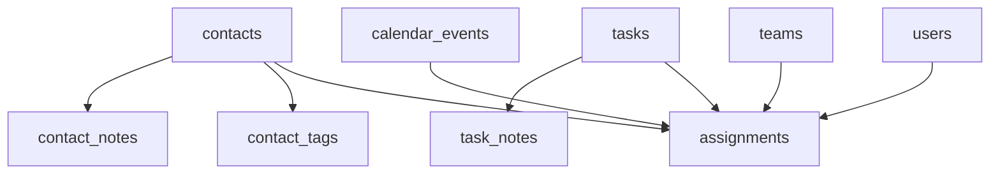
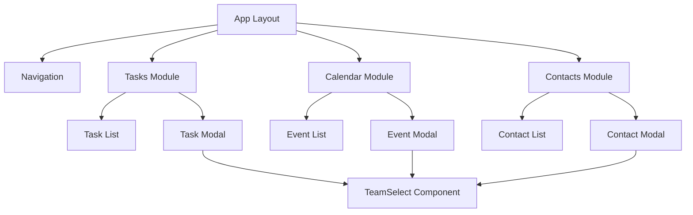
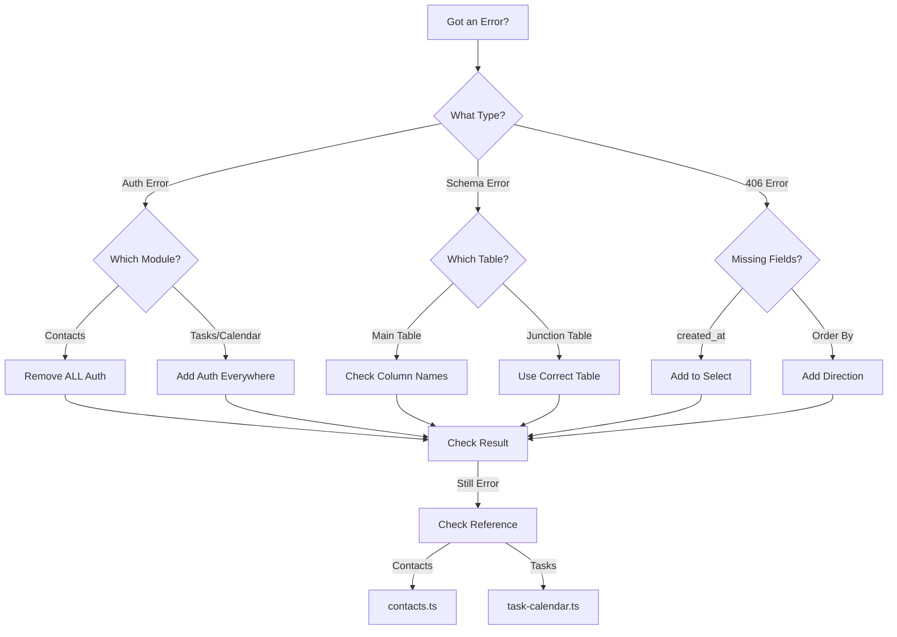

# Lovable CRM Project Guide

## 🚀 Quick Navigation - Start Here!

### 👋 New to the Project?
1. First time setup → [Project Setup](#1-project-setup)
2. Understanding the codebase → [Project Overview](#-project-overview-read-first)
3. Where to find examples → [Quick Reference](#-quick-reference---working-examples)

### 🔧 Adding New Features?
1. Check current focus → [Current Development Focus](#-current-development-focus)
2. Find reference code → [Module-Specific Requirements](#1-module-specific-requirements-read-first)
3. Follow patterns → [Database Access Patterns](#5-database-access-patterns)

### ❌ Getting Errors?
1. Common errors → [STOP! READ THIS IF YOU GET ERRORS](#-stop-read-this-if-you-get-errors)
2. Auth problems → [Authentication Errors](#c-authentication-errors-most-frequent)
3. Schema issues → [Schema Cache Errors](#b-schema-cache-errors)
4. Quick fixes → [Top 5 New Agent Mistakes](#top-5-new-agent-mistakes-dont-do-these)

### 🤔 Not Sure About Auth?
1. Which pattern to use → [Authentication Decision Tree](#2-authentication-decision-tree-required)
2. Common mistakes → [Common Auth Mistakes](#3-common-auth-mistakes-avoid-these)
3. Validation steps → [Auth Validation Checklist](#4-auth-validation-checklist-use-this)

## 🚀 Project Overview (READ FIRST!)

### Current State
- ✅ Working Tasks Module (Reference Implementation)
  - Full CRUD operations
  - Assignment system
  - Auth required
  - Use this as template for auth features

- ✅ Working Calendar Module (Reference Implementation)
  - Event management
  - Auth required
  - Use this as template for auth features

- ✅ Working Contacts Module (Public Access)
  - Basic CRUD
  - NO auth required
  - Use this as template for public features

### Current Focus
- 🎯 Extending Assignment System
  - Tasks → Calendar → Contacts
  - Adding TeamSelect to forms
  - Department validation
  - Assignment filters

### Key Architecture Points
1. **Auth Pattern:**
   - Tasks/Calendar: REQUIRES auth
   - Contacts: NO auth (public)
   - Never mix these patterns!

2. **Data Pattern:**
   - Main tables (contacts, tasks, events)
   - Junction tables for relations (_notes, _tags, etc.)
   - Always include created_at in queries

3. **Component Pattern:**
   - Modals follow Tasks/Calendar pattern
   - Forms use consistent validation
   - Error handling is standardized

### Database Schema Overview



#### Table Requirements:

1. **Main Tables**
   ```sql
   -- Public Tables (NO AUTH)
   contacts (
     id uuid PRIMARY KEY,
     name text NOT NULL,
     email text,
     created_at timestamptz DEFAULT now(),
     -- NO user_id or auth fields!
   )

   -- Auth Required Tables
   tasks (
     id uuid PRIMARY KEY,
     title text NOT NULL,
     user_id uuid REFERENCES users(id),  -- Required!
     created_at timestamptz DEFAULT now()
   )

   calendar_events (
     id uuid PRIMARY KEY,
     title text NOT NULL,
     user_id uuid REFERENCES users(id),  -- Required!
     created_at timestamptz DEFAULT now()
   )
   ```

2. **Junction Tables**
   ```sql
   -- Notes Tables (Follow this pattern!)
   contact_notes (
     id uuid PRIMARY KEY,
     contact_id uuid REFERENCES contacts(id),
     content text,
     created_at timestamptz DEFAULT now()
   )

   task_notes (
     id uuid PRIMARY KEY,
     task_id uuid REFERENCES tasks(id),
     content text,
     created_at timestamptz DEFAULT now()
   )

   -- Assignment Tables
   assignments (
     id uuid PRIMARY KEY,
     assignable_id uuid NOT NULL,
     assignable_type text NOT NULL,
     assigned_to uuid NOT NULL,
     assigned_to_type text NOT NULL,
     created_at timestamptz DEFAULT now(),
     UNIQUE(assignable_id, assignable_type, assigned_to, assigned_to_type)
   )
   ```

#### Common Schema Mistakes:

1. ❌ Adding auth fields to public tables
   ```sql
   -- WRONG
   contacts (
     user_id uuid,  -- Don't add this!
     is_public boolean  -- Don't add this!
   )
   ```

2. ❌ Missing required columns
   ```sql
   -- WRONG
   contact_notes (
     content text
     -- Missing created_at!
     -- Missing contact_id reference!
   )
   ```

3. ❌ Wrong relationship types
   ```sql
   -- WRONG
   contacts (
     notes text[],  -- Don't store arrays!
     tags text[]    -- Use junction tables!
   )
   ```

### Component Hierarchy & Patterns



#### Component Patterns:

1. **Modal Pattern (FOLLOW THIS)**
   ```typescript
   // src/components/shared/base-modal.tsx
   interface ModalProps {
     isOpen: boolean
     onClose: () => void
     data?: any
   }

   // Implementation Pattern
   export function ExampleModal({ isOpen, onClose, data }: ModalProps) {
     // 1. Form state
     const [formData, setFormData] = useState(data || defaultData)
     
     // 2. Submit handler
     const handleSubmit = async (e: React.FormEvent) => {
       e.preventDefault()
       try {
         // Service call
         await exampleService.update(formData)
         // Success handling
         onClose()
         toast.success('Updated successfully')
       } catch (error) {
         // Error handling
         console.error('Error:', error)
         toast.error('Update failed')
       }
     }
     
     return (
       <Dialog open={isOpen}>
         <form onSubmit={handleSubmit}>
           {/* Form fields */}
         </form>
       </Dialog>
     )
   }
   ```

2. **List Pattern (FOLLOW THIS)**
   ```typescript
   // src/components/shared/base-list.tsx
   interface ListProps {
     data: any[]
     onEdit: (item: any) => void
     onDelete: (id: string) => void
   }

   export function ExampleList({ data, onEdit, onDelete }: ListProps) {
     // 1. State
     const [sortField, setSortField] = useState('created_at')
     const [sortOrder, setSortOrder] = useState<'asc' | 'desc'>('desc')
     
     // 2. Handlers
     const handleSort = (field: string) => {
       // Sort logic
     }
     
     return (
       <div>
         {/* List header */}
         <div className="list-header">
           {/* Sort controls */}
         </div>
         
         {/* List items */}
         {data.map(item => (
           <ListItem
             key={item.id}
             item={item}
             onEdit={() => onEdit(item)}
             onDelete={() => onDelete(item.id)}
           />
         ))}
       </div>
     )
   }
   ```

3. **Form Pattern (FOLLOW THIS)**
   ```typescript
   // src/components/shared/base-form.tsx
   interface FormProps {
     initialData?: any
     onSubmit: (data: any) => Promise<void>
   }

   export function ExampleForm({ initialData, onSubmit }: FormProps) {
     // 1. Form state
     const [formData, setFormData] = useState(initialData || {})
     const [errors, setErrors] = useState({})
     
     // 2. Validation
     const validate = (data: any) => {
       const errors = {}
       // Add validation rules
       return errors
     }
     
     // 3. Submit handler
     const handleSubmit = async (e: React.FormEvent) => {
       e.preventDefault()
       const validationErrors = validate(formData)
       if (Object.keys(validationErrors).length > 0) {
         setErrors(validationErrors)
         return
       }
       
       try {
         await onSubmit(formData)
       } catch (error) {
         console.error('Form error:', error)
         toast.error('Submission failed')
       }
     }
     
     return (
       <form onSubmit={handleSubmit}>
         {/* Form fields */}
       </form>
     )
   }
   ```

#### Common Component Mistakes:

1. ❌ Adding auth checks in Contacts components
   ```typescript
   // WRONG
   function ContactList() {
     const session = useSession()  // Don't do this!
     if (!session) return <SignIn />  // Don't do this!
   ```

2. ❌ Not following modal pattern
   ```typescript
   // WRONG
   function WrongModal() {
     const [open, setOpen] = useState(false)  // Don't manage state here
     const handleClose = () => setOpen(false)  // Don't handle here
   ```

3. ❌ Mixing service calls
   ```typescript
   // WRONG
   function MixedComponent() {
     // Don't mix these!
     const { data: tasks } = await supabase.from('tasks')
     const { data: contacts } = await fetch('/api/contacts')
   }
   ```

## 🚀 STOP! READ THIS IF YOU GET ERRORS

### Common Error Types & Quick Fixes:

1. **"No session" or "Unauthorized" Errors**
   - Are you in Contacts module? → Remove ALL auth/session code
   - Are you in Tasks/Calendar? → Add session to EVERY function
   - Not sure? → Check Module-Specific Requirements below

2. **"Column not found in schema cache"**
   - Looking for 'notes'? → Use contact_notes table instead
   - Looking for 'created_at'? → Always include in select
   - Not sure? → Check Database Access Patterns below

3. **"406 Not Acceptable"**
   - Missing 'created_at' in select? → Add it
   - Wrong table name? → Check reference implementation
   - Not sure? → See Common Errors section below

### Quick Module Check:
```typescript
// IN CONTACTS MODULE?
✅ NO auth needed
✅ Direct database access
✅ Reference: contacts.ts

// IN TASKS/CALENDAR?
✅ MUST have session
✅ MUST check auth
✅ Reference: task-calendar.ts
```

## 🚀 First Steps (Start Here!)

### 1. Project Setup
```bash
# 1. Install dependencies
npm install

# 2. Set up environment variables (see section 8)

# 3. Start development server
npm run dev
```

### 2. CRITICAL: Read This First!
Before making ANY changes:
1. Check if similar functionality exists in the Tasks or Calendar modules
2. These are our reference implementations - copy their patterns exactly
3. Never create new patterns without team approval

### 3. Core Development Rules
1. ✅ ALWAYS use direct Supabase client from `@/lib/supabase/client`
2. ❌ NEVER create new API routes unless absolutely necessary
3. ✅ ALWAYS follow existing patterns from Tasks/Calendar modules
4. ❌ NEVER add auth checks where not needed (check RLS settings)

## 1. Module-Specific Requirements (READ FIRST)

### Tasks Module
- ✅ REQUIRES session
- ✅ REQUIRES user_id checks
- ✅ Uses RLS
- 📁 Reference: `src/lib/supabase/services/task-calendar.ts`

### Calendar Module
- ✅ REQUIRES session
- ✅ REQUIRES user_id checks
- ✅ Uses RLS
- 📁 Reference: `src/lib/supabase/services/calendar.ts`

### Contacts Module
- ❌ NO session required
- ❌ NO user_id checks
- ❌ RLS disabled
- 📁 Reference: `src/lib/supabase/services/contacts.ts`

## 2. Authentication Decision Tree (REQUIRED)

1. First, check your module type:
   ```typescript
   // Tasks/Calendar Module → REQUIRES auth
   export const taskService = {
     async getItems(session: Session) {  // Session REQUIRED
       if (!session?.user?.id) throw new Error('Unauthorized')
       // ... rest of code
     }
   }

   // Contacts Module → PUBLIC access
   export const contactsService = {
     async getItems() {  // NO session parameter
       // Direct database access
       const { data, error } = await supabase.from('contacts')
       // ... rest of code
     }
   }
   ```

2. Check the reference implementation:
   - Tasks → Check `task-calendar.ts`
   - Calendar → Check `calendar.ts`
   - Contacts → Check `contacts.ts`

3. Follow the EXACT pattern:
   ```typescript
   // Pattern A: Auth Required (Tasks/Calendar)
   import { supabase } from '@/lib/supabase/client'
   import { Session } from '@supabase/supabase-js'
   
   export const service = {
     async method(session: Session) {  // Session REQUIRED
       if (!session?.user?.id) throw new Error('Unauthorized')
       // ... rest of code
     }
   }

   // Pattern B: Public Access (Contacts)
   import { supabase } from '@/lib/supabase/client'
   
   export const service = {
     async method() {  // NO session parameter
       // Direct database access
       const { data, error } = await supabase.from('contacts')
       // ... rest of code
     }
   }
   ```

## 3. Common Auth Mistakes (AVOID THESE)

1. ❌ Adding session checks to public modules
   ```typescript
   // WRONG - Contacts is public
   if (!session?.user?.id) throw new Error('Unauthorized')
   ```

2. ❌ Missing session checks in auth-required modules
   ```typescript
   // WRONG - Tasks/Calendar need auth
   const { data } = await supabase.from('tasks')
   ```

3. ❌ Mixing API routes with direct access
   ```typescript
   // WRONG - Don't mix patterns
   const response = await fetch('/api/tasks')
   const { data } = await supabase.from('contacts')
   ```

4. ❌ Inconsistent session handling
   ```typescript
   // WRONG - Inconsistent
   async function one(session: Session) {}
   async function two() {}  // Missing session
   ```

## 4. Auth Validation Checklist (USE THIS)

Before implementing:
1. □ Which module am I working in?
2. □ Does this module require auth? (Check Module-Specific Requirements)
3. □ Am I using the correct pattern? (Check Authentication Decision Tree)
4. □ Are all methods in my service consistent? (All require session or none do)

After implementing:
1. □ Compare against reference implementation
2. □ Verify session handling matches module type
3. □ Check for mixed patterns (API routes vs direct access)
4. □ Test both authenticated and unauthenticated states

## 5. Database Access Patterns

### A. Type Definitions (REQUIRED)
```typescript
// 1. Database Types - EXACT match to columns
interface DatabaseType {
  id: string
  start_time: string        // DB format
  created_at: string        // DB format
  user_id: string          // Foreign keys
  assigned_to: string | null
  assigned_to_type: 'user' | 'team' | null
}

// 2. UI Types - After conversion
interface UIType {
  id: string
  start: Date              // Converted
  createdAt: Date         // Converted
  user: {                 // Expanded
    id: string
    name: string
  }
  assignedTo: {           // Expanded
    id: string
    type: 'user' | 'team'
    name: string
  } | null
}

// 3. Input Types - For create/update
interface DatabaseInput {
  // Omit auto-generated fields
  start_time: string
  user_id: string
  // etc...
}
```

### B. Service Layer Pattern (REQUIRED)
```typescript
export const exampleService = {
  // 1. Get Operation
  async getItems() {
    try {
      // a. Get main data
      const { data, error } = await supabase
        .from('table')
        .select('*')
      if (error) throw error

      // b. Get related data
      const userIds = data.map(item => item.user_id)
      const { data: users } = await supabase
        .from('users')
        .select('id, name')
        .in('id', userIds)
      
      // c. Create lookup maps
      const userMap = users.reduce((acc, user) => ({
        ...acc,
        [user.id]: user
      }), {})

      // d. Convert and return
      return data.map(item => ({
        ...item,
        start: new Date(item.start_time),
        user: userMap[item.user_id]
      }))
    } catch (error) {
      console.error('[Service] Error:', error)
      throw new Error(error.message)
    }
  },

  // 2. Create Operation
  async createItem(input: DatabaseInput) {
    try {
      const { data, error } = await supabase
        .from('table')
        .insert(input)
        .select()
        .single()
      
      if (error) throw error
      return this.convertToUIType(data)
    } catch (error) {
      console.error('[Service] Create error:', error)
      throw new Error(error.message)
    }
  }
}
```

### C. Multi-Table Operations (REQUIRED)
```typescript
async function withRelations() {
  try {
    // 1. Main operation first
    const { data, error } = await supabase
      .from('main')
      .insert(mainData)
      .select()
      .single()
    
    if (error) throw error

    // 2. Related operations after
    const { error: relatedError } = await supabase
      .from('related')
      .insert({
        main_id: data.id,
        // other fields
      })

    if (relatedError) throw relatedError

    // 3. Return converted data
    return this.convertToUIType(data)
  } catch (error) {
    console.error('[Service] Error:', error)
    throw new Error(error.message)
  }
}
```

## 6. Common Errors & Solutions (READ THIS FIRST!)

### A. PATCH/PUT Errors (Most Common!)
```
PATCH https://[project].supabase.co/rest/v1/contacts?id=eq.[id]&select=* 400 (Bad Request)
Error: Could not find the 'notes' column of 'contacts' in the schema cache
Code: PGRST204
```

**Root Causes:**
1. Trying to update columns that don't exist in the main table
2. Sending related data to wrong table
3. Missing junction table operations

**Solutions:**
1. Split your updates:
   ```typescript
   // WRONG ❌
   await supabase
     .from('contacts')
     .update({
       name: 'John',
       notes: ['Note 1', 'Note 2']  // Wrong table!
     })
   
   // RIGHT ✅
   // 1. Update contact
   const { data: contact, error } = await supabase
     .from('contacts')
     .update({ name: 'John' })
     .eq('id', contactId)
     .select()
   
   // 2. Update notes separately
   const { error: notesError } = await supabase
     .from('contact_notes')
     .insert(notes.map(note => ({
       contact_id: contactId,
       content: note,
       created_at: new Date().toISOString()
     })))
   ```

2. Check your service layer:
   ```typescript
   // WRONG ❌
   export const contactsService = {
     async updateContact(contact: Contact) {
       return supabase
         .from('contacts')
         .update(contact)  // Might include notes!
     }
   }
   
   // RIGHT ✅
   export const contactsService = {
     async updateContact({ id, name, email, ...rest }) {
       // 1. Update main contact
       const { data, error } = await supabase
         .from('contacts')
         .update({ name, email })
         .eq('id', id)
         .select()
       if (error) throw error
       
       // 2. Handle notes separately
       if (rest.notes?.length) {
         await this.updateContactNotes(id, rest.notes)
       }
       
       return data
     }
   }
   ```

3. Use proper interfaces:
   ```typescript
   // WRONG ❌
   interface Contact {
     id: string
     name: string
     notes: string[]  // Wrong! Not in main table
   }
   
   // RIGHT ✅
   interface Contact {
     id: string
     name: string
   }
   
   interface ContactNote {
     id: string
     contact_id: string
     content: string
     created_at: string
   }
   ```

### B. Schema Cache Errors
```
Error: "Could not find column 'notes' in the schema cache"
Error: "Could not find column 'created_at' in the schema cache"
```

**Root Causes:**
1. Column doesn't exist in database
2. Using wrong table name
3. Missing required columns in select statement

**Solutions:**
1. Check table structure:
   ```sql
   -- WRONG ❌
   contacts (
     notes text  -- Don't put notes in main table!
   )
   
   -- RIGHT ✅
   contact_notes (
     contact_id uuid references contacts(id),
     content text,
     created_at timestamp with time zone
   )
   ```

2. Always include required columns:
   ```typescript
   // WRONG ❌
   .select('content')  // Missing created_at
   
   // RIGHT ✅
   .select('content, created_at')  // Include all required
   ```

3. Use junction tables for related data:
   ```typescript
   // WRONG ❌
   interface Contact {
     notes: string[]  // Don't store arrays!
   }
   
   // RIGHT ✅
   interface ContactNote {
     contact_id: string
     content: string
     created_at: string
   }
   ```

### B. 406 (Not Acceptable) Errors
```
Error: 406 Not Acceptable - Request format not acceptable
```

**Root Causes:**
1. Missing required columns in select
2. Wrong data format
3. Invalid query structure

**Solutions:**
1. Include ALL required columns:
   ```typescript
   // WRONG ❌
   .select('id, content')
   
   // RIGHT ✅
   .select('id, content, created_at')  // created_at required!
   ```

2. Check query structure:
   ```typescript
   // WRONG ❌
   .select('*')
   .in('id', ids)
   .order('created_at')  // Missing direction
   
   // RIGHT ✅
   .select('*')
   .in('id', ids)
   .order('created_at', { ascending: false })
   ```

### C. Authentication Errors (MOST FREQUENT!)
```
Error: No session found in [function]
Error: Session required for [operation]
Error: Could not find column [x] in schema cache
Error: Unauthorized - Session required
```

**Common Error Patterns:**
1. Same error, different functions:
   ```typescript
   // Error Pattern 1: Missing Session ❌
   "No session found in getNotes"
   "No session found in getTasks"
   "No session found in getEvents"
   
   // Error Pattern 2: Schema Cache ❌
   "Could not find column 'notes' in schema cache"
   "Could not find column 'created_at' in schema cache"
   "Could not find column 'tasks' in schema cache"
   ```

**Root Causes:**
1. Adding auth where not needed (Contacts)
2. Missing auth where needed (Tasks/Calendar)
3. Inconsistent auth patterns within a module
4. Schema cache errors due to auth confusion

**Quick Fixes:**
1. For Contacts Module:
   ```typescript
   // REMOVE ALL auth ��
   export const contactsService = {
     getNotes() {  // No session
       return supabase.from('contact_notes').select('*')
     },
     getTags() {   // No session
       return supabase.from('contact_tags').select('*')
     }
   }
   ```

2. For Tasks/Calendar:
   ```typescript
   // ADD auth consistently ✅
   export const taskService = {
     getTasks(session: Session) {
       if (!session?.user?.id) throw new Error('Unauthorized')
       return supabase.from('tasks').select('*')
     },
     getNotes(session: Session) {  // Same pattern
       if (!session?.user?.id) throw new Error('Unauthorized')
       return supabase.from('task_notes').select('*')
     }
   }
   ```

**Error Prevention Checklist:**
1. □ Is this a Contacts component/service?
   - Remove ALL auth checks
   - Remove ALL session parameters
   - Use direct database access

2. □ Is this a Tasks/Calendar component/service?
   - Add session parameter to ALL methods
   - Add auth check to ALL methods
   - Use consistent error messages

3. □ Mixed functionality?
   - Split into separate services
   - Keep auth patterns separate
   - Don't mix public/private access

**Common Mistakes by Module:**

1. Contacts Module Mistakes:
   ```typescript
   // WRONG ❌
   if (!session) throw new Error('No session')  // Remove this
   if (!user) return null                       // Remove this
   withAuth(Component)                          // Remove this
   
   // RIGHT ✅
   direct database access                       // Just use this
   ```

2. Tasks/Calendar Mistakes:
   ```typescript
   // WRONG ❌
   async function withoutSession() {}           // Add session
   .from('tasks').select('*')                  // Add user check
   
   // RIGHT ✅
   async function withSession(session: Session) {
     if (!session?.user?.id) throw new Error('Unauthorized')
     return supabase
       .from('tasks')
       .select('*')
       .eq('user_id', session.user.id)
   }
   ```

3. Schema Cache + Auth Mistakes:
   ```typescript
   // WRONG ❌ - Mixed concerns
   async function confused(session: Session) {
     // 1. Wrong auth
     if (!session) throw new Error('No session')
     
     // 2. Wrong table access
     const { data } = await supabase
       .from('contacts')
       .select('notes')  // Wrong! Notes is separate table
   }
   
   // RIGHT ✅ - Clean separation
   async function clean() {  // No session for contacts!
     // 1. Get contact
     const { data: contact } = await supabase
       .from('contacts')
       .select('*')
     
     // 2. Get notes separately
     const { data: notes } = await supabase
       .from('contact_notes')
       .select('*')
   }
   ```

## 7. Need Help?

If stuck:
1. Look at Tasks/Calendar implementation first
2. Compare your code against the patterns in this guide
3. Check if auth is actually needed
4. Verify your types match the database exactly

### Error Handling Flowchart:
```
Got an Error? → Start Here
        ↓
What type of error?
├─── Auth Error ("No session", "Unauthorized")
│    ├─── In Contacts? → Remove ALL auth
│    └─── In Tasks/Cal? → Add session to EVERY function
│
├─── Schema Error ("Column not found")
│    ├─── Looking for 'notes'? → Use contact_notes table
│    ├─── Looking for 'created_at'? → Add to select
│    └─── Other column? → Check table structure
│
└─── 406 Error ("Not Acceptable")
     ├── Select statement? → Add 'created_at'
     └── Order by? → Add direction {ascending: false}

Still stuck? → Check reference implementation:
├─── Contacts → src/lib/supabase/services/contacts.ts
└─── Tasks/Cal → src/lib/supabase/services/task-calendar.ts
```

### Top 5 New Agent Mistakes (Don't Do These!)

1. **❌ Adding auth to Contacts**
   ```typescript
   // DON'T DO THIS IN CONTACTS MODULE!
   if (!session) throw new Error('No session')
   if (!user) return null
   withAuth(Component)
   ```
   ✅ Just use direct database access in Contacts

2. **❌ Putting notes in main table**
   ```typescript
   // DON'T DO THIS!
   .from('contacts')
   .select('notes')  // Wrong! Notes is separate table
   ```
   ✅ Use contact_notes table instead

3. **❌ Missing created_at**
   ```typescript
   // DON'T DO THIS!
   .select('id, content')  // Missing created_at
   ```
   ✅ Always include created_at in select

4. **❌ Mixing auth patterns**
   ```typescript
   // DON'T MIX THESE!
   async function one(session: Session) {}
   async function two() {}  // Inconsistent!
   ```
   ✅ Be consistent: all functions need session or none do

5. **❌ Copying wrong module**
   ```typescript
   // DON'T COPY TASKS PATTERN FOR CONTACTS!
   export const contactsService = {
     async getContacts(session: Session) {  // Wrong!
       if (!session) throw new Error('No session')
   ```
   ✅ Check module type first, then copy correct pattern

### 🔍 Quick Reference - Working Examples

Need to implement something? Check these first:

1. **Adding Auth**
   ```
   src/lib/supabase/services/task-calendar.ts
   src/components/tasks/task-modal.tsx
   ```

2. **Public Access**
   ```
   src/lib/supabase/services/contacts.ts
   src/components/contacts/create-contact-modal.tsx
   ```

3. **Assignment System**
   ```
   src/components/shared/team-select.tsx
   src/lib/supabase/services/assignments.ts
   ```

4. **Error Handling**
   ```
   src/lib/supabase/services/error-handler.ts
   src/components/shared/error-boundary.tsx
   ```

5. **Form Validation**
   ```
   src/components/tasks/task-form.tsx
   src/lib/utils/validation.ts
   ```

### 🎯 Current Development Focus

When adding new features:
1. ✅ Check if similar exists in Tasks/Calendar
2. ✅ Copy the EXACT pattern
3. ✅ Follow module-specific rules (auth vs no-auth)
4. ✅ Use existing components where possible
5. ❌ Don't create new patterns without team approval

## 8. Troubleshooting Decision Tree



### Quick Error Resolution Steps:

1. **Auth Errors**
   ```
   Error → Module Type → Action
   No session → Contacts → Remove auth
   No session → Tasks → Add session
   ```

2. **Schema Errors**
   ```
   Error → Table Type → Action
   notes not found → Main → Use junction table
   created_at missing → Any → Add to select
   ```

3. **406 Errors**
   ```
   Error → Field Type → Action
   created_at → Select → Add field
   order by → Query → Add direction
   ```

## 9. Recent Changes & Updates

### Latest Updates (2024-01-22)
1. **Assignment System**
   - Added to Contacts module
   - TeamSelect component integration
   - Department validation

2. **Auth Patterns**
   - Simplified Contacts auth (removed all checks)
   - Standardized Tasks/Calendar auth
   - Updated error messages

3. **Schema Updates**
   - Added created_at to all tables
   - Moved notes to junction tables
   - Updated assignment relationships

### Known Issues & Solutions:
1. **Notes Column Error**
   ```typescript
   // FIXED: Use contact_notes table
   const { data } = await supabase
     .from('contact_notes')
     .select('content, created_at')
   ```

2. **Auth Confusion**
   ```typescript
   // FIXED: No auth in Contacts
   export const contactsService = {
     getContacts() {  // No session param
       return supabase.from('contacts')
     }
   }
   ```

3. **406 Errors**
   ```typescript
   // FIXED: Include created_at
   .select('*, created_at')
   .order('created_at', { ascending: false })
   ```

4. **Assignment Name Display**
   ```typescript
   // WRONG: Don't join directly with users/teams in contacts module ❌
   .select(`
     *,
     users!contacts_assigned_to_fkey (name)
   `)

   // RIGHT: Fetch names in separate queries ✅
   const { data: users } = await supabase
     .from('users')
     .select('id, name')
     .in('id', userIds)

   const { data: teams } = await supabase
     .from('teams')
     .select('id, name')
     .in('id', teamIds)

   // Then map the names to contacts
   return contacts.map(contact => ({
     ...contact,
     assigned_name: contact.assigned_to_type === 'user'
       ? userMap[contact.assigned_to || '']
       : teamMap[contact.assigned_to || '']
   }))
   ```
   - Problem: Trying to join with auth-protected tables in public module
   - Solution: Fetch names separately and map them to contacts
   - Best Practice: Keep contacts module public, handle relationships through separate queries

### Upcoming Changes:
1. **Assignment System**
   - Adding filters by department
   - Extending to Calendar module
   - Improving validation rules

2. **Component Updates**
   - Standardizing modal patterns
   - Adding error boundaries
   - Improving form validation

3. **Schema Updates**
   - Adding indexes for performance
   - Optimizing junction tables
   - Enhancing type safety

[Rest of existing content...]