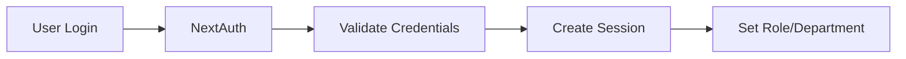
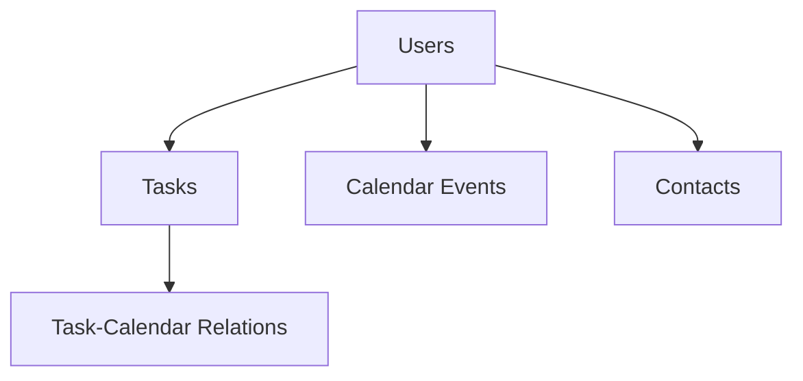

# Lovable CRM Project Guide

## 🚀 First Steps (Start Here!)

### 1. Project Setup
```bash
# 1. Install dependencies
npm install

# 2. Set up environment variables (see section 8)

# 3. Start development server
npm run dev
```

### 2. Key Files to Review First
- `src/types/calendar.ts` - Core type definitions
- `src/lib/supabase/client.ts` - Database setup
- `src/components/calendar/event-modal.tsx` - Example component

### 3. Basic Component Structure
```typescript
// Example from src/components/calendar/event-modal.tsx
export function EventModal({ 
  isOpen,          // Modal state
  onClose,         // Close handler
  onSave,          // Save handler
  event,           // Data object
  session,         // Auth session
  initialData      // Default values
}: EventModalProps) {
  // ... component logic
}
```

## 1. Project Overview

### What We're Building
A modern CRM system with:
- ✅ Task Management
- ✅ Calendar Integration
- ✅ Contact Management
- ✅ User & Team Management

### Tech Stack
- **Frontend**: Next.js 13+ with App Router
- **Database**: Supabase (PostgreSQL)
- **Auth**: NextAuth.js
- **UI**: Custom components with Tailwind

### Core Principles
1. Type safety everywhere
2. Consistent error handling
3. Role-based access
4. Department-level data isolation

## 2. System Architecture

### A. Authentication Flow


### B. Database Structure


### C. Key Components
1. **Task System**:
   ```typescript
   // Real example from src/types/tasks.ts
   interface Task {
     id: string
     title: string
     description?: string
     status: 'todo' | 'in-progress' | 'completed'
     priority: 'low' | 'medium' | 'high'
     assigned_to?: string
     assigned_to_type?: 'user' | 'team'
   }
   ```

2. **Calendar System**:
   ```typescript
   // Real example from src/types/calendar.ts
   interface CalendarEvent {
     id: string
     title: string
     start: Date        // UI format
     end: Date          // UI format
     start_time: string // DB format
     end_time: string   // DB format
   }
   ```

## 3. Common Development Patterns

### A. Service Layer Pattern
```typescript
// Real example from task-calendar.ts
export const taskCalendarService = {
  async createEventForTask(
    taskId: string,
    eventData: Partial<CalendarEvent>,
    session: Session
  ): Promise<CalendarEvent> {
    // 1. Validate session
    if (!session?.user?.id) throw new Error('Unauthorized')

    // 2. Convert UI types to DB types
    const dbEvent = {
      title: eventData.title,
      start_time: eventData.start?.toISOString(),
      end_time: eventData.end?.toISOString(),
      // ... other fields
    }

    // 3. Database operation
    const { data, error } = await supabase
      .from('calendar_events')
      .insert(dbEvent)
      .select()
      .single()

    // 4. Error handling
    if (error) {
      console.error('Event creation error:', error)
      throw error
    }

    // 5. Convert DB types back to UI types
    return {
      id: data.id,
      title: data.title,
      start: new Date(data.start_time),
      end: new Date(data.end_time),
      // ... other fields
    }
  }
}
```

### B. Component Error Handling
```typescript
// Real example from task-modal.tsx
const handleEventSave = async (eventData: Partial<CalendarEvent>) => {
  try {
    if (!task?.id) return

    const event = await taskCalendarService.createEventForTask(
      task.id,
      eventData,
      session
    )

    // Update UI
    setLinkedEvents(prev => [...prev, event])
    setIsEventModalOpen(false)

  } catch (error) {
    console.error('Failed to save event:', error)
    // Show error to user
  }
}
```

## 4. Common Issues & Solutions

### A. "Invalid Date" Errors
**Problem**: Calendar events showing "Invalid Date"
**Cause**: Mismatch between DB and UI date formats
**Solution**:
```typescript
// Wrong ❌
const start = dbEvent.start_time // string

// Right ✅
const start = new Date(dbEvent.start_time)
```

### B. Type Mismatches
**Problem**: TypeScript errors with database fields
**Solution**: Use proper type conversion
```typescript
// Wrong ❌
const event: CalendarEvent = dbEvent

// Right ✅
const event: CalendarEvent = {
  ...dbEvent,
  start: new Date(dbEvent.start_time),
  end: new Date(dbEvent.end_time)
}
```

### C. Authentication Errors
**Problem**: 401/403 errors
**Solution**: Check session handling
```typescript
// Wrong ❌
const { data } = await supabase.from('tasks').select()

// Right ✅
if (!session?.user?.id) throw new Error('Unauthorized')
const { data } = await supabase
  .from('tasks')
  .select()
  .eq('user_id', session.user.id)
```

## 5. Development Checklist

### Before Starting
- [ ] Run project locally successfully
- [ ] Read this guide completely
- [ ] Review similar components
- [ ] Understand type system

### During Development
- [ ] Follow existing patterns
- [ ] Handle all errors
- [ ] Test with real data
- [ ] Add comments for complex logic

### Before Committing
- [ ] No type errors
- [ ] No console.logs
- [ ] Tests pass
- [ ] Documentation updated

## 6. Security Guidelines

### Critical Rules
1. ❌ NEVER use service role key in client
2. ❌ NEVER store plain passwords
3. ✅ ALWAYS check session
4. ✅ ALWAYS validate input

## 7. Environment Setup
```env
# Copy to .env.local
NEXT_PUBLIC_SUPABASE_URL=your_url
NEXT_PUBLIC_SUPABASE_ANON_KEY=your_key
SUPABASE_SERVICE_ROLE_KEY=your_service_key
NEXTAUTH_SECRET=your_secret
NEXTAUTH_URL=http://localhost:3001
```

## 8. Need Help?

### Common Questions
1. "Where do I start?"
   → Check First Steps section above

2. "How do I add a new feature?"
   → Look for similar components first

3. "Getting type errors?"
   → Check Common Issues section

### Key Resources
- Component examples: `src/components`
- Type definitions: `src/types`
- Service layer: `src/lib/supabase/services`

Remember:
1. Types first, implementation second
2. Check existing components for patterns
3. Use the service layer for DB operations
4. When stuck, check this guide!