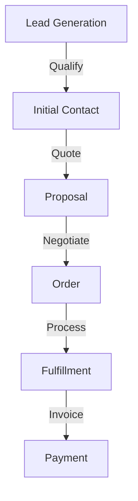
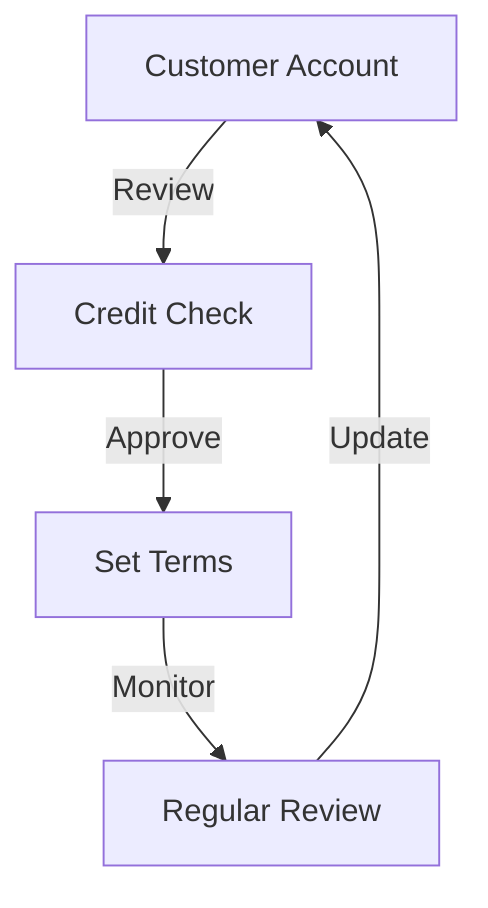
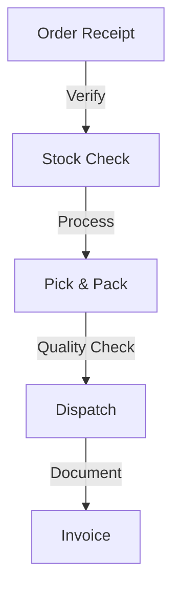
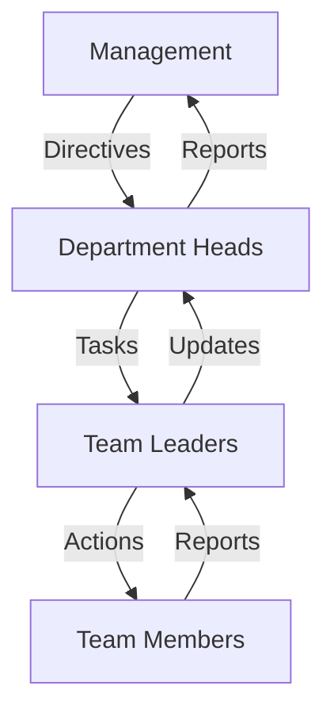
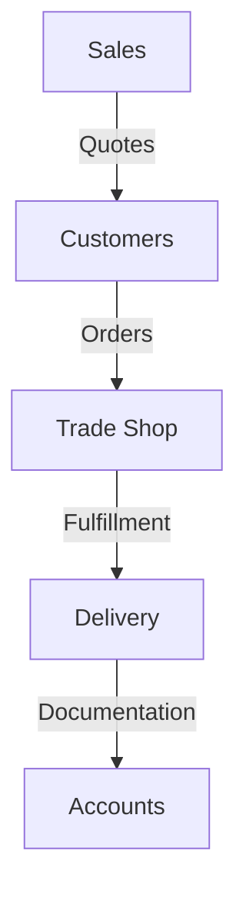

# Bonnymans Company Structure

## Departments

### 1. Sales Department
- Customer relationship management
- Lead generation
- Quote preparation
- Order processing

### 2. Accounts Department
- Financial management
- Invoicing
- Payment processing
- Financial reporting

### 3. Trade Shop
- Product management
- Stock control
- Order fulfillment
- Customer service

### 4. Sales/Admin
- Sales support
- Administrative tasks
- Documentation
- Customer support

## Workflow Structure

### 1. Sales Process

### 2. Account Management

### 3. Order Processing

## Access Levels

### 1. Management Level
- Full system access
- Cross-department visibility
- Strategic planning tools
- Performance analytics

### 2. Department Level
- Department-specific access
- Team management
- Department reporting
- Resource allocation

### 3. Operational Level
- Task-specific access
- Individual reporting
- Basic CRM functions
- Personal dashboard

## Communication Flow

### Internal Communication

### External Communication

## System Access Requirements

### Sales Department
- Contact management
- Quote generation
- Order processing
- Customer history

### Accounts Department
- Financial records
- Invoice management
- Payment tracking
- Credit control

### Trade Shop
- Inventory management
- Order fulfillment
- Stock control
- Dispatch management

### Sales/Admin
- Document management
- Customer support
- Administrative tools
- Communication tools

## Reporting Structure

### Management Reports
- Cross-department performance
- Financial overview
- Strategic metrics
- Resource utilization

### Department Reports
- Team performance
- Department metrics
- Resource allocation
- Task completion

### Operational Reports
- Individual performance
- Task tracking
- Time management
- Activity logs

## Security Considerations

### Data Access
- Role-based permissions
- Department segregation
- Audit trailing
- Data encryption

### System Security
- User authentication
- Access logging
- Regular audits
- Security updates

## Integration Requirements

### Internal Systems
- CRM integration
- Accounting software
- Inventory management
- Document management

### External Systems
- Supplier portals
- Customer portals
- Shipping systems
- Payment gateways

## Training Requirements

### System Training
- Basic navigation
- Feature utilization
- Security awareness
- Best practices

### Role-Specific Training
- Department functions
- Specialized tools
- Workflow processes
- Reporting tools

## Maintenance Procedures

### Regular Updates
- System updates
- Security patches
- Feature updates
- Bug fixes

### Data Management
- Regular backups
- Data cleaning
- Archive management
- Storage optimization
