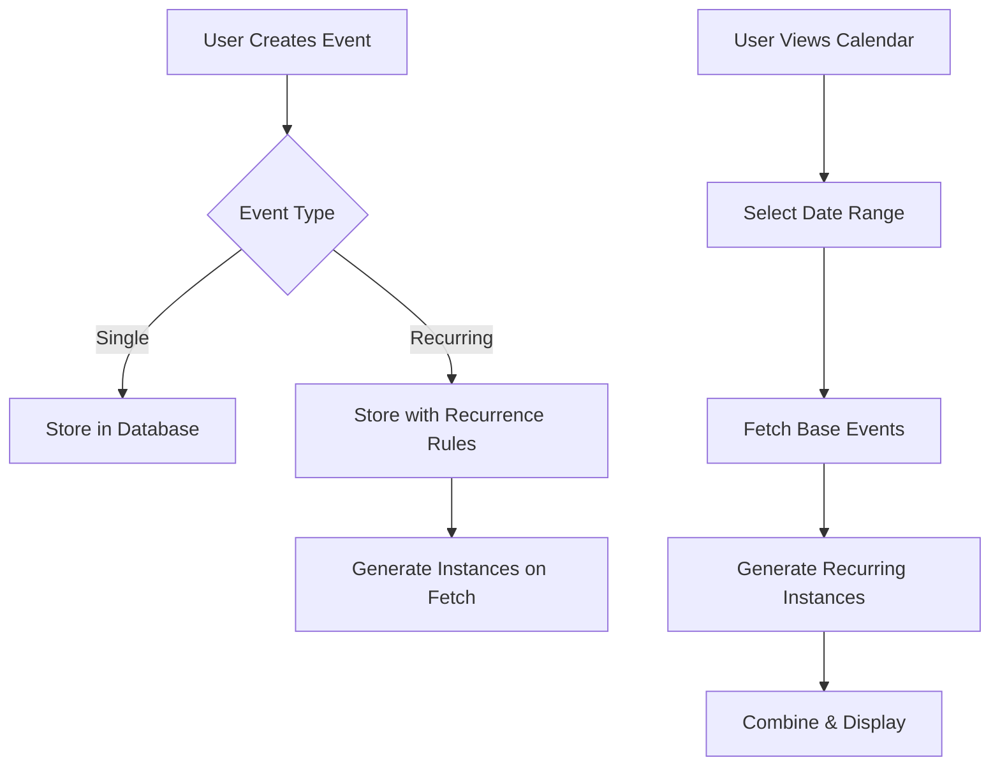

# Calendar System Documentation

## Overview
The calendar system implements a recurring event management system with:
- Single and recurring event support
- Real-time event generation for recurring events
- Three-column layout UI (Main Calendar, Event List, Event Details)
- Role-based access control
- Team/Department event assignment

## Event Flow


## UI Integration

### 1. Calendar Views
- **Month View**: 
  - Full month grid layout
  - Event previews with overflow indicators
  - Quick date navigation

- **Week View**:
  - 7-day detailed timeline
  - Hour-by-hour event slots
  - Drag-to-create support

- **Day View**:
  - Single day detailed schedule
  - Full event details visible
  - Time-block visualization

### 2. Event Creation
- **Split View Form**:
  - Upper card: Basic details (title, dates)
  - Lower card: Advanced options
  - Real-time validation

- **Recurrence Options**:
  - Frequency selection
  - Interval configuration
  - End date setting
  - Exception date handling

- **Assignment Features**:
  - User assignment
  - Team assignment
  - Department selection

### 3. Event Display
- Color coding by category
- Drag-and-drop rescheduling
- Recurring event indicators
- Status and priority badges

## Database Schema

### calendar_events Table
Primary table for calendar events:

```sql
CREATE TABLE calendar_events (
    id UUID PRIMARY KEY DEFAULT uuid_generate_v4(),
    title TEXT NOT NULL,
    description TEXT,
    start_time TIMESTAMPTZ NOT NULL,
    end_time TIMESTAMPTZ NOT NULL,
    category TEXT,
    user_id UUID NOT NULL REFERENCES auth.users(id),
    assigned_to UUID REFERENCES users(id),
    assigned_to_type TEXT CHECK (assigned_to_type IN ('user', 'team')),
    department TEXT,
    recurrence JSONB,
    created_at TIMESTAMPTZ NOT NULL DEFAULT NOW(),
    updated_at TIMESTAMPTZ NOT NULL DEFAULT NOW()
);
```

## Type Definitions

```typescript
export type RecurrenceFrequency = 'daily' | 'weekly' | 'monthly'

export interface RecurrenceRule {
  frequency: RecurrenceFrequency
  interval?: number
  endDate?: Date
  exception_dates?: string[]
}

export interface CalendarEvent {
  id: string
  title: string
  description: string
  start: Date
  end: Date
  category: EventCategory
  user_id: string
  status: StatusType      // UI-only field, defaults to 'scheduled'
  priority: PriorityType  // UI-only field, defaults to 'medium'
  type?: 'call' | 'email' | 'meeting' | 'follow_up'  // UI-only field, defaults to 'meeting'
  assigned_to?: string
  assigned_to_type?: 'user' | 'team'
  department?: string
  recurrence?: RecurrenceRule
}
```

## Recurring Events System

### 1. Creating Recurring Events
- Events can be set to repeat daily, weekly, or monthly
- Each recurrence has:
  - Frequency (daily/weekly/monthly)
  - Interval (every X days/weeks/months)
  - Optional end date
  - Optional exception dates

### 2. Handling Recurring Instances
- Original event stored in database
- Instances generated on-the-fly when fetching events
- Each instance has unique ID: `${originalId}_${yyyyMMddHHmmss}`
- Instances track their original event ID and instance date

### 3. Deleting Recurring Events

#### Delete Single Instance
- **Option**: 'single'
- **Behavior**:
  - Adds instance date to exception_dates array
  - Instance no longer appears in generated events
  - Other instances remain unchanged

#### Delete Future Instances
- **Option**: 'future'
- **Behavior**:
  - Updates original event's end_date
  - No instances generated after this date

#### Delete Entire Series
- **Option**: 'all'
- **Behavior**:
  - Deletes the original event
  - All instances are removed

## Implementation Details

```typescript
// Calendar Service Interface
interface CalendarService {
  getEvents(start: Date, end: Date, session: UserSession): Promise<CalendarEvent[]>
  createEvent(event: Omit<CalendarEvent, 'id'>, session: UserSession): Promise<CalendarEvent>
  updateEvent(event: Partial<CalendarEvent>, session: UserSession): Promise<CalendarEvent>
  deleteEvent(id: string, session: UserSession, deleteOption?: RecurringEventDeleteOption, instanceDate?: Date): Promise<void>
  getEventById(id: string, session: UserSession): Promise<CalendarEvent>
}

// Example Usage:
// Create Event
const event = await calendarService.createEvent({
  title: "Meeting",
  description: "Team sync",
  start: new Date(),
  end: new Date(),
  category: "work",
  recurrence: {
    frequency: "weekly",
    interval: 1,
    endDate: new Date("2024-12-31")
  }
}, session);

// Delete Instance
await calendarService.deleteEvent(eventId, session, 'single', instanceDate);
```

## Common Issues & Solutions

### 1. Event Not Showing
- **Check Date Range**:
  ```typescript
  // Ensure date range is correct
  const start = startOfDay(new Date())
  const end = endOfDay(new Date())
  ```
- **Verify Permissions**:
  ```typescript
  // Events are filtered by user_id
  // Check session.user.id matches event.user_id
  ```
- **Recurring Event Issues**:
  ```typescript
  // Check exception_dates array
  // Verify end_date hasn't passed
  // Confirm recurrence rule is valid
  ```

### 2. Recurring Event Updates
- Changes to original affect all future instances
- Exception dates prevent specific instances
- End date limits instance generation
- Be careful with timezone handling

### 3. Performance Considerations
- Recurring events generated on-the-fly
- Large date ranges can slow performance
- Consider limiting initial fetch range
- Use pagination for event lists

## Important Notes

1. **Database vs UI Fields**
   - Some fields exist only in UI layer (status, priority, type)
   - These have default values when converting from DB to UI

2. **Recurrence Handling**
   - Recurrence stored as JSONB in database
   - Instances generated dynamically
   - Exception dates stored in ISO format

3. **Session Validation**
   - All operations require valid user session
   - Events filtered by user_id
   - Session validated before any database operation

4. **Best Practices**
   - Always use date-fns for date manipulation
   - Validate recurrence rules before saving
   - Handle timezone differences explicitly
   - Use proper error handling for all operations