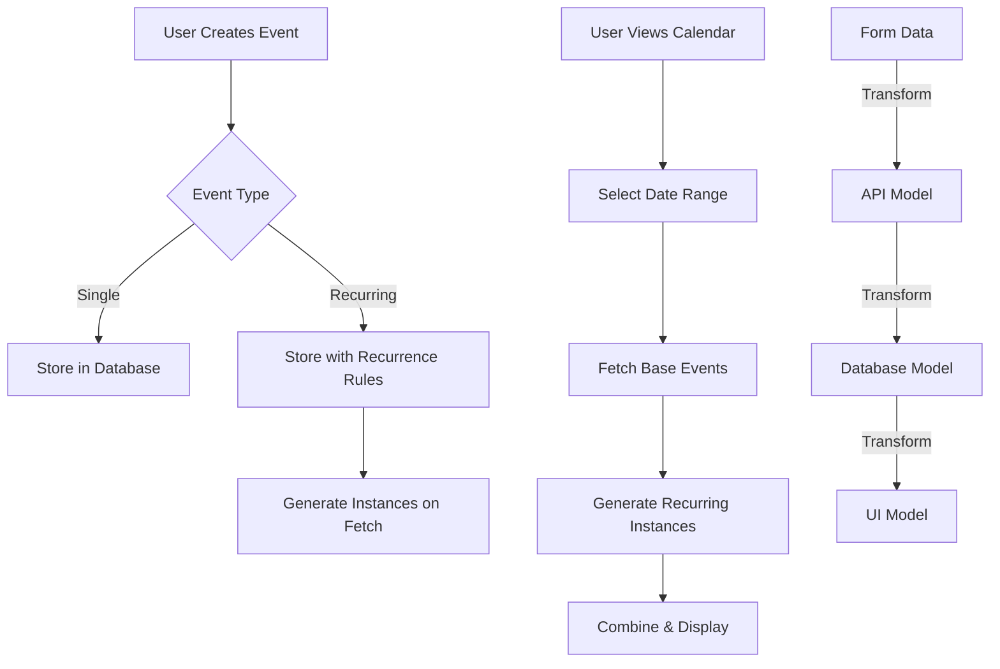

# Calendar System Documentation

## Quick Start Guide

### Basic Operations
```typescript
// 1. Create a simple event
const simpleEvent = await calendarService.createEvent({
  title: "Team Meeting",
  description: "Weekly sync",
  start: new Date('2024-01-15T10:00:00Z'),
  end: new Date('2024-01-15T11:00:00Z'),
  category: "work"
});

// 2. Create a recurring event
const recurringEvent = await calendarService.createEvent({
  title: "Weekly Team Sync",
  description: "Regular team catch-up",
  start: new Date('2024-01-15T10:00:00Z'),
  end: new Date('2024-01-15T11:00:00Z'),
  category: "work",
  recurrence: {
    frequency: "weekly",
    interval: 1,
    endDate: new Date('2024-12-31')  // Optional
  }
});

// 3. Delete an instance of a recurring event
await calendarService.deleteEvent(
  eventId,
  session,
  'single',
  new Date('2024-01-22T10:00:00Z')
);

// 4. Update an event
await calendarService.updateEvent({
  id: eventId,
  title: "Updated Meeting Title",
  description: "New description"
});

// 5. Fetch events for a date range
const events = await calendarService.getEvents(
  new Date('2024-01-01'),
  new Date('2024-01-31')
);
```

### Common Gotchas and Solutions

1. **Timezone Issues**
```typescript
// ❌ WRONG: Using local timezone
const startDate = new Date('2024-01-15');  // Uses local timezone

// ✅ CORRECT: Always use explicit UTC
const startDate = new Date('2024-01-15T00:00:00Z');  // Explicit UTC
// OR
const startDate = toUTC(new Date('2024-01-15'));
```

2. **Date Format Mismatches**
```typescript
// ❌ WRONG: Inconsistent formats
const event = {
  recurrence: {
    end_date: "2024/01/15",  // Wrong format
    exception_dates: ["01-15-2024"]  // Wrong format
  }
};

// ✅ CORRECT: Consistent YYYY-MM-DD format
const event = {
  recurrence: {
    end_date: "2024-01-15",  // Correct format
    exception_dates: ["2024-01-15"]  // Correct format
  }
};
```

3. **Recurrence Validation**
```typescript
// ❌ WRONG: Missing required fields
const invalid = {
  frequency: "weekly",  // Missing interval
};

// ✅ CORRECT: All required fields
const valid = {
  frequency: "weekly",
  interval: 1
};
```

4. **DST Transitions**
```typescript
// ❌ WRONG: Not handling DST
const nextOccurrence = addDays(event.start, 7);  // Might be off by an hour

// ✅ CORRECT: Use UTC consistently
const nextOccurrence = new Date(
  addDays(toUTC(event.start), 7).toISOString()
);
```

## Database Schema

### calendar_events Table
```sql
CREATE TABLE calendar_events (
    -- Primary Fields
    id UUID PRIMARY KEY DEFAULT uuid_generate_v4(),
    title TEXT NOT NULL,
    description TEXT,
    start_time TIMESTAMPTZ NOT NULL,
    end_time TIMESTAMPTZ NOT NULL,
    category TEXT,
    
    -- User and Assignment
    user_id UUID NOT NULL REFERENCES auth.users(id),
    assigned_to UUID REFERENCES users(id),
    assigned_to_type TEXT CHECK (assigned_to_type IN ('user', 'team')),
    department TEXT,
    
    -- Recurrence
    recurrence JSONB,  -- Stores recurrence rule
    
    -- Metadata
    created_at TIMESTAMPTZ NOT NULL DEFAULT NOW(),
    updated_at TIMESTAMPTZ NOT NULL DEFAULT NOW()
);

-- Indexes for performance
CREATE INDEX idx_calendar_events_user_id ON calendar_events(user_id);
CREATE INDEX idx_calendar_events_start_time ON calendar_events(start_time);
CREATE INDEX idx_calendar_events_assigned_to ON calendar_events(assigned_to);
```

### JSONB Recurrence Structure
```json
{
  "frequency": "daily | weekly | monthly | yearly",
  "interval": 1,  // Required, positive integer
  "end_date": "2024-01-15",  // Optional, YYYY-MM-DD
  "exception_dates": [  // Optional
    "2024-01-01",
    "2024-01-15"
  ]
}
```

## Overview
The calendar system implements a recurring event management system with:
- Single and recurring event support
- Real-time event generation for recurring events
- Three-column layout UI (Main Calendar, Event List, Event Details)
- Role-based access control
- Team/Department event assignment

## Event Flow


## Data Models & Transformations

### 1. Form to API Transformation
```typescript
// Form Data (what user inputs)
interface EventFormData {
  title: string;
  description: string;
  start: Date;
  end: Date;
  recurrence?: {
    frequency: 'none' | 'daily' | 'weekly' | 'monthly' | 'yearly';
    interval: number;
    endDate?: Date;  // Browser date picker format
  }
}

// Transforms to API Model
interface RecurrenceRule {
  frequency: RecurrenceFrequency;  // 'none' removed
  interval: number;
  endDate?: Date | null;  // camelCase
  exception_dates?: string[];  // YYYY-MM-DD format
}
```

### 2. API to Database Transformation
```typescript
// API Model transforms to Database Model
interface DatabaseRecurrence {
  frequency: 'daily' | 'weekly' | 'monthly' | 'yearly';
  interval: number;
  end_date?: string;  // snake_case, YYYY-MM-DD format
  exception_dates?: string[];  // YYYY-MM-DD format
}

// Example transformation:
const toDatabase = (apiModel: RecurrenceRule): DatabaseRecurrence => ({
  frequency: apiModel.frequency,
  interval: apiModel.interval,
  end_date: apiModel.endDate ? format(apiModel.endDate, 'yyyy-MM-dd') : undefined,
  exception_dates: apiModel.exception_dates
});
```

### 3. Database to UI Transformation
```typescript
// Database Model transforms to UI Model (CalendarEvent)
interface CalendarEvent {
  // ... other fields ...
  recurrence?: RecurrenceRule | null;
  is_recurring_instance?: boolean;
  original_event_id?: string;
  instance_date?: string;  // ISO string for UI
}

// Example transformation:
const toUI = (dbEvent: DatabaseEvent): CalendarEvent => ({
  ...dbEvent,
  recurrence: dbEvent.recurrence ? {
    frequency: dbEvent.recurrence.frequency,
    interval: dbEvent.recurrence.interval,
    endDate: dbEvent.recurrence.end_date ? parseISO(dbEvent.recurrence.end_date) : null,
    exception_dates: dbEvent.recurrence.exception_dates || []
  } : null
});
```

## Validation Rules

### 1. Form Validation
```typescript
const validateEventForm = (formData: EventFormData): ValidationError[] => {
  const errors = [];
  
  // Required fields
  if (!formData.title) errors.push('Title is required');
  if (!formData.start) errors.push('Start date is required');
  if (!formData.end) errors.push('End date is required');
  
  // Date validation
  if (formData.end < formData.start) {
    errors.push('End date must be after start date');
  }
  
  // Recurrence validation
  if (formData.recurrence && formData.recurrence.frequency !== 'none') {
    if (!formData.recurrence.interval || formData.recurrence.interval < 1) {
      errors.push('Interval must be a positive number');
    }
    
    if (formData.recurrence.endDate && formData.recurrence.endDate < formData.start) {
      errors.push('Recurrence end date must be after event start date');
    }
  }
  
  return errors;
}
```

### 2. Database Validation
```typescript
const validateDatabaseModel = (event: DatabaseEvent): void => {
  // Required fields
  if (!event.title) throw new Error('Title is required');
  if (!event.start_time) throw new Error('Start time is required');
  if (!event.end_time) throw new Error('End time is required');
  if (!event.user_id) throw new Error('User ID is required');
  
  // Recurrence validation
  if (event.recurrence) {
    if (!['daily', 'weekly', 'monthly', 'yearly'].includes(event.recurrence.frequency)) {
      throw new Error('Invalid recurrence frequency');
    }
    
    if (!Number.isInteger(event.recurrence.interval) || event.recurrence.interval < 1) {
      throw new Error('Interval must be a positive integer');
    }
    
    // Validate date formats
    if (event.recurrence.end_date && !/^\d{4}-\d{2}-\d{2}$/.test(event.recurrence.end_date)) {
      throw new Error('Invalid end_date format. Must be YYYY-MM-DD');
    }
    
    if (event.recurrence.exception_dates) {
      event.recurrence.exception_dates.forEach(date => {
        if (!/^\d{4}-\d{2}-\d{2}$/.test(date)) {
          throw new Error('Invalid exception date format. Must be YYYY-MM-DD');
        }
      });
    }
  }
}
```

## Instance Generation

### 1. Instance ID Format
```typescript
// Format: originalId_yyyyMMddHHmmss
// Example: 123e4567-e89b-12d3-a456-426614174000_20240115093000

const generateInstanceId = (originalId: string, instanceDate: Date): string => {
  const timestamp = format(instanceDate, 'yyyyMMddHHmmss');
  return `${originalId}_${timestamp}`;
};

// Parsing instance ID
const parseInstanceId = (instanceId: string): { originalId: string, instanceDate: Date } => {
  const [originalId, timestamp] = instanceId.split('_');
  return {
    originalId,
    instanceDate: parse(timestamp, 'yyyyMMddHHmmss', new Date())
  };
};
```

### 2. Instance Generation Rules
```typescript
const generateInstances = (
  event: CalendarEvent,
  rangeStart: Date,
  rangeEnd: Date
): CalendarEvent[] => {
  if (!event.recurrence) return [event];
  
  const instances: CalendarEvent[] = [];
  let currentDate = startOfDay(event.start);
  const endDate = event.recurrence.endDate 
    ? startOfDay(event.recurrence.endDate)
    : addYears(rangeEnd, 1); // Limit infinite recurrence
    
  while (currentDate <= endDate && currentDate <= rangeEnd) {
    // Skip if date is in exceptions
    if (!event.recurrence.exception_dates?.includes(
      format(currentDate, 'yyyy-MM-dd')
    )) {
      instances.push({
        ...event,
        id: generateInstanceId(event.id, currentDate),
        start: currentDate,
        end: addMinutes(
          currentDate,
          differenceInMinutes(event.end, event.start)
        ),
        is_recurring_instance: true,
        original_event_id: event.id,
        instance_date: format(currentDate, "yyyy-MM-dd'T'HH:mm:ss'Z'")
      });
    }
    
    // Advance to next instance
    switch (event.recurrence.frequency) {
      case 'daily':
        currentDate = addDays(currentDate, event.recurrence.interval);
        break;
      case 'weekly':
        currentDate = addWeeks(currentDate, event.recurrence.interval);
        break;
      case 'monthly':
        currentDate = addMonths(currentDate, event.recurrence.interval);
        break;
      case 'yearly':
        currentDate = addYears(currentDate, event.recurrence.interval);
        break;
    }
  }
  
  return instances;
};
```

## Troubleshooting Guide

### 1. Event Creation Issues

#### Problem: Event Not Saving
```typescript
// Common causes:
// 1. Missing required fields
await calendarService.createEvent({
  title: "Meeting",  // Required
  description: "Optional",
  start: new Date(),  // Required
  end: new Date(),  // Required
  category: "work"
});

// 2. Invalid recurrence data
const event = {
  // ... event data ...
  recurrence: {
    frequency: "weekly",
    interval: 0  // Error: must be > 0
  }
};
```

#### Problem: Recurrence Not Working
```typescript
// Common causes:
// 1. Incorrect date formats
const badFormat = {
  frequency: "weekly",
  interval: 1,
  end_date: "2024/01/15"  // Wrong format
};

const correctFormat = {
  frequency: "weekly",
  interval: 1,
  end_date: "2024-01-15"  // Correct YYYY-MM-DD
};

// 2. End date before start date
const invalidDates = {
  start: new Date('2024-01-15'),
  end: new Date('2024-01-14'),  // Error: end before start
  recurrence: {
    frequency: "weekly",
    interval: 1
  }
};
```

### 2. Instance Issues

#### Problem: Missing Instances
```typescript
// Common causes:
// 1. Date in exception_dates
const event = {
  // ... event data ...
  recurrence: {
    frequency: "weekly",
    interval: 1,
    exception_dates: ["2024-01-15"]  // This date will be skipped
  }
};

// 2. Outside date range
const tooNarrow = await calendarService.getEvents(
  new Date('2024-01-01'),
  new Date('2024-01-07')  // Won't show instances after this
);

// 3. End date reached
const ended = {
  // ... event data ...
  recurrence: {
    frequency: "weekly",
    interval: 1,
    end_date: "2024-01-01"  // No instances after this
  }
};
```

#### Problem: Duplicate Instances
```typescript
// Common cause: Overlapping date ranges in multiple calls
const range1 = await calendarService.getEvents(
  new Date('2024-01-01'),
  new Date('2024-01-31')
);

const range2 = await calendarService.getEvents(
  new Date('2024-01-15'),  // Overlaps with range1
  new Date('2024-02-15')
);

// Solution: Use non-overlapping ranges or merge results
```

### 3. Deletion Issues

#### Problem: Instance Not Deleted
```typescript
// Common causes:
// 1. Wrong delete option
await calendarService.deleteEvent(
  eventId,
  session,
  'single'  // Needs instanceDate
);

// Correct usage:
await calendarService.deleteEvent(
  eventId,
  session,
  'single',
  new Date('2024-01-15')
);

// 2. Wrong instance date format
const wrongFormat = new Date('2024/01/15');  // Use ISO string
const correctFormat = new Date('2024-01-15T00:00:00Z');
```

#### Problem: Unexpected Deletions
```typescript
// Common cause: Wrong delete option
await calendarService.deleteEvent(
  eventId,
  session,
  'all'  // Deletes entire series
);

// To delete single instance:
await calendarService.deleteEvent(
  eventId,
  session,
  'single',
  instanceDate
);
```

## Best Practices

1. **Date Handling**
```typescript
// Always use UTC for storage
const toUTC = (date: Date) => {
  return new Date(date.toISOString());
};

// Use consistent format for database
const toDBFormat = (date: Date) => {
  return format(date, 'yyyy-MM-dd');
};

// Parse dates safely
const parseDate = (dateString: string) => {
  const parsed = parseISO(dateString);
  if (!isValid(parsed)) {
    throw new Error('Invalid date format');
  }
  return parsed;
};
```

2. **Validation**
```typescript
// Always validate before database operations
const validateEvent = async (event: CalendarEvent) => {
  const errors = validateEventForm(event);
  if (errors.length > 0) {
    throw new Error(`Validation failed: ${errors.join(', ')}`);
  }
  await validateDatabaseModel(event);
};
```

3. **Error Handling**
```typescript
try {
  await calendarService.createEvent(event);
} catch (error) {
  if (error.message.includes('Validation')) {
    // Handle validation errors
    showValidationError(error.message);
  } else if (error.code === '23505') {
    // Handle duplicate key errors
    showDuplicateError();
  } else {
    // Handle other errors
    showGeneralError();
  }
}
```

4. **Performance**
```typescript
// Limit date ranges
const MAX_RANGE_MONTHS = 3;

const getEvents = async (start: Date, end: Date) => {
  if (differenceInMonths(end, start) > MAX_RANGE_MONTHS) {
    throw new Error('Date range too large');
  }
  // ... fetch events
};

// Cache recurring event calculations
const eventCache = new Map<string, CalendarEvent[]>();
```

Remember:
- Always validate input data
- Use consistent date formats
- Handle timezone differences
- Cache recurring calculations
- Limit date ranges for performance
- Test edge cases thoroughly